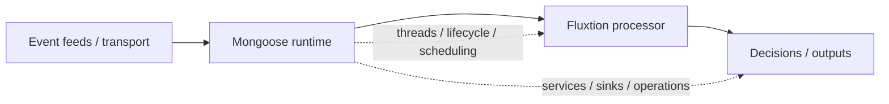

# Run Fluxtion in Mongoose

Fluxtion and [Mongoose](https://telaminai.github.io/mongoose/) together form a complete in-process stack for real-time decision systems.

- Fluxtion defines how decisions execute — deterministically and with minimal latency
- Mongoose defines how those decisions run — handling feeds, threads, and lifecycle

This tutorial shows how to run a Fluxtion processor inside a Mongoose runtime.

## What this demonstrates

- Define a Fluxtion DataFlow (decision logic)
- Map a Mongoose event feed to the processor
- Run the processor inside a Mongoose server

## Architecture at a glance

Think of Fluxtion as the brain, and Mongoose as the nervous system that feeds it inputs and delivers outputs.

## Why Mongoose is a natural runtime for Fluxtion

Fluxtion focuses on **deterministic execution semantics**—how your components are coordinated and in what order they recompute. Mongoose focuses on **runtime infrastructure**—how events are ingested, how threads are managed, and how the overall application lifecycle is controlled.

By combining them, you get:

- **Clean separation**: Business logic remains in Fluxtion; infrastructure remains in Mongoose.
- **Controlled threading**: Mongoose handles agent-based threading and thread-safe delivery of events to the processor.
- **Operational control**: Mongoose provides YAML configuration, logging, and metrics around your Fluxtion processor.

## Start with the Mongoose stream tutorial

This tutorial is the fastest way to get a working system running. It shows a minimal end-to-end example: a feed, a Fluxtion processor, and a running server.

The canonical "hello world" for this integration is hosted on the Mongoose documentation site. It walks you through a minimal example of a streaming price filter.

👉 **[Start the Mongoose + Fluxtion Stream Tutorial](https://telaminai.github.io/mongoose/getting-started/stream-programming-tutorial/)**

## Next: Advanced Fluxtion + Mongoose example

Once you have mastered the basics of hosting a processor, you can explore more complex patterns such as:

- **Stateful signal calculation**: Using Fluxtion's windowing and aggregation inside a managed feed.
- **Multiple event types**: Coordinating disparate streams using Fluxtion's multi-type dispatch.
- **Replayable decision logic**: Leveraging Mongoose's replay capabilities to verify deterministic behavior.

For a deeper dive into the architectural relationship, see **[Running Fluxtion with Mongoose](../home/fluxtion-with-mongoose.md)**.
