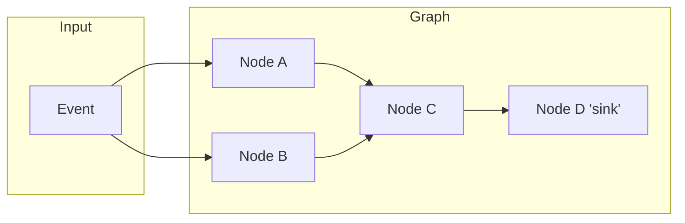

# Concepts and architecture
---

Fluxtion processes events through a directed acyclic graph (DAG) of nodes. Nodes declare their dependencies; Fluxtion
computes a topological order and invokes each node at most once per incoming event.

## Core concepts

- Event: an input object delivered to the graph via DataFlow.onEvent(...) or a bound source.
- Node: a unit of computation with inputs (dependencies) and optional outputs. Nodes can be stateless or stateful.
- DAG: the dependency graph built by the builder; edges indicate that downstream nodes depend on upstream results.
- Dispatch: on each event, Fluxtion schedules only nodes impacted by that event and runs them in topological order.
- Sink: a terminal node that publishes results (e.g., to logs, collections, metrics, or external systems).

## Execution model at a glance

- Topological dispatch: for a given event, nodes are invoked respecting dependencies (A and B before C, C before D).
- At‑most‑once per node per event: each node runs at most one time per event; no duplicate invocations in the same pass.
- Incremental recomputation: only nodes reachable from the changed inputs are scheduled. Unaffected subgraphs don’t run.
- Deterministic order: ties are resolved consistently; repeated runs over the same graph and event types are
  predictable.

## What triggers recomputation?

- New event arrives that a node subscribes to directly.
- Upstream node’s output changes (e.g., new aggregate value, updated state), making downstream dependents dirty.
- Time/window rollovers if you use windowed operators (bucket expiry triggers an update in that subgraph).
- Explicit triggers from lifecycle callbacks (advanced usage).

## Interpreted vs compiled graphs
Fluxtion supports two execution styles. Pick based on latency, footprint, and deployment needs.

- Interpreted graph
    - How it works: Builds the graph at runtime and dispatches via a generic interpreter/dispatcher.
    - Pros: Fast iteration; minimal build steps; easier to inspect/modify graphs during development.
    - Cons: Slightly higher call‑path overhead; may use more reflection/indirection; more allocations.
    - When to pick: Local development, prototyping, dynamic configurations, moderate throughput.

- Compiled (ahead‑of‑time) graph
    - How it works: The builder generates specialized Java sources/bytecode for your graph; the runtime invokes direct
      methods.
    - Pros: Lowest latency and GC; fewer indirections; small, predictable footprint; great for production SLOs.
    - Cons: Build step required; graph is fixed at compile time (rebuild to change structure).
    - When to pick: Latency‑sensitive services, high QPS pipelines, constrained environments (edge), cost‑efficiency
      goals.

## Guidance

- Start interpreted during development for speed of iteration.
- Switch to compiled for production critical paths; benchmark to validate the gains for your workload.

## Related reading

- Why Fluxtion
- 1 minute tutorial
- Tutorial Part‑1
