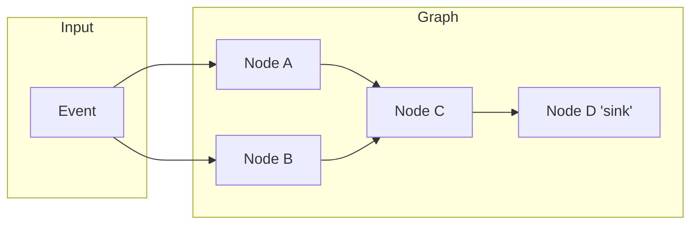

# Execution model
---

Fluxtion processes events through a directed acyclic graph (DAG) of nodes. The engine moves coordination from **runtime → compile time** by analyzing dependencies at build time and generating an optimized execution plan.

## The Spreadsheet analogy

A DataFlow is like a **spreadsheet on steroids**.
- **Nodes** are formula cells.
- **Dependencies** are cell references.
- **Events** are cell updates.

In a spreadsheet, you don't tell the engine *how* to recompute; you just define the formulas and their relationships. The engine calculates the global set of relationships and manages recalculation when any cell is updated. This delegating of the mechanical but difficult task of calculating global dependencies to an algorithm allows for systems that are complex but very predictable.

## Core concepts

- **Event**: An input object delivered to the graph via `DataFlow.onEvent(...)` or a bound source.
- **Node**: A unit of computation with inputs (dependencies) and optional outputs. Nodes can be stateless or stateful.
- **DAG**: The dependency graph built by the builder; edges indicate that downstream nodes depend on upstream results.
- **Dispatch**: On each event, Fluxtion schedules only nodes impacted by that event and runs them in a precomputed topological order.
- **Sink**: A terminal node that publishes results (e.g., to logs, collections, metrics, or external systems).

## The Specialist Execution Graph (SEG)

Fluxtion builds a **Specialist Execution Graph (SEG)** by analyzing your object graph at construction time. This pre-calculated dispatch logic provides several guarantees:

- **Topological dispatch**: Nodes are invoked in a strict upstream-to-downstream order.
- **At-most-once per node per event**: Each node is invoked at most once per event cycle, eliminating duplicate work and glitches.
- **Incremental recomputation**: Only nodes connected to the executing root event handler are triggered. Unaffected subgraphs do not run.
- **Deterministic order**: Repeated runs over the same graph and event sequence are bit-for-bit identical.

## Interpreted vs Compiled graphs

Fluxtion supports two execution styles to balance development speed with production performance.

### Interpreted graph
Built at runtime using the **DataFlow-Builder**. It runs in an interpreted mode for local development, prototyping, and fast iteration.

### Compiled (AOT) graph
The **DataFlow-Compiler** takes the output from the builder and generates specialized Java source code or bytecode. This **Ahead-Of-Time (AOT)** container removes runtime interpretation overhead, reflection, and proxying. Compiled DataFlows typically deliver **10x performance gains** over interpreted mode.

## Thread safety and concurrency

Fluxtion is designed for **single-threaded deterministic execution** within a single processor.

- **EventProcessors are not thread-safe**: A single event should be processed to completion before the next event is delivered.
- **Parallelism via partitioning**: Scale-out is achieved by running multiple independent DataFlow instances (e.g., one per partition/shard), managed by a runtime like [Mongoose](fluxtion-with-mongoose.md).

## Related reading

- [Deterministic coordination](../reference/deterministic-coordination.md)
- [Why Fluxtion exists](why-fluxtion.md)
- [Event Processor Model](../reference/event-processor-model.md)
