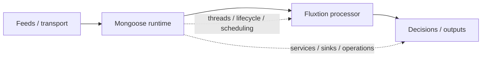

# Running Fluxtion with Mongoose

Fluxtion and [Mongoose](https://telaminai.github.io/mongoose/) solve different parts of the same problem.

Together, Fluxtion and Mongoose form a complete in-process stack for real-time decision systems.

This separation allows each layer to evolve independently:
- Fluxtion focuses on execution performance and correctness
- Mongoose focuses on runtime orchestration and operations

Fluxtion provides deterministic execution for event-driven decision logic, while Mongoose provides the runtime around it: feeds, threads, lifecycle, scheduling, and operational wiring.

Use Fluxtion when you need predictable execution. Use Mongoose when you need to run that execution model inside a managed event-driven runtime.

Mongoose is a natural runtime companion for Fluxtion, but Fluxtion does not require Mongoose.

This gives you a practical way to build real-time systems without mixing execution logic with runtime infrastructure, where:

* Fluxtion handles **deterministic decision logic**
* Mongoose handles **runtime concerns such as threading, feeds, and lifecycle management**

## How the responsibilities split

| Concern               | Fluxtion                      | Mongoose                                   |
| --------------------- | ----------------------------- | ------------------------------------------ |
| Execution order       | Deterministic, compiled       | Runs the processor                         |
| Decision logic        | Compiled and executed deterministically | Hosted and integrated                      |
| Event feeds           | Via integration points        | Native runtime responsibility              |
| Threading             | Not the focus                 | Manages thread hops (Agent model)          |
| Memory allocation     | Zero-GC options               | Manages any event memory allocation        |
| Processor segregation | Segregated memory per-process | Hosts multiple isolated processors         |
| Output                | Produces results or state     | Routes outputs and manages thread delivery |
| Scheduling            | Not the focus                 | Built-in services                          |
| Lifecycle             | Processor lifecycle           | Server lifecycle                           |
| Operational wiring    | Limited                       | Core responsibility                        |

## Why combine them

Fluxtion is strongest when you want predictable execution of interdependent logic inside a process. Mongoose is strongest when you want to run event-driven applications with controlled threading, feed wiring, scheduling, and lifecycle. Mongoose documents agent-based concurrency, configurable idle strategies, event replay, scheduling, and object pooling as part of its runtime model.

That makes the pairing natural: each system focuses on a different layer, without overlap or duplication. This gives you a clean split: Fluxtion owns execution semantics; Mongoose owns runtime semantics.

* Mongoose receives and routes events
* Fluxtion executes the decision graph deterministically
* Mongoose manages the runtime environment around that graph

## Architecture at a glance

## How it runs (end-to-end)

1. **Mongoose** receives events from a feed (e.g., Kafka, File, or Network)
2. **Mongoose** delivers these events to the **Fluxtion** processor, managing **thread hops** and **event memory**
3. **Mongoose** can route events to **multiple Fluxtion processors**, each executing in a **segregated memory space**
4. **Fluxtion** executes the decision graph deterministically in a single pass
5. **Each Fluxtion processor** produces outputs or state updates
6. **Mongoose** routes these outputs to the configured sinks or services, managing any necessary **thread hops**

## When this combination is a good fit

Use Fluxtion with Mongoose when you want:

* deterministic business logic execution
* explicit control over threading and event ingestion
* a runtime that can host event feeds, services, and sinks
* low-latency processing inside a single JVM process
* clear separation between decision logic and runtime infrastructure

## What Mongoose adds around Fluxtion

Mongoose already provides:

* event feeds and sources
* processor hosting
* agent/thread execution
* scheduling
* operational control
* [plugin extension architecture](https://telaminai.github.io/mongoose/overview/plugin_extension_architecture/) (see below)
* replay and synthetic time guidance
* zero-GC and object-pooling options

See the Mongoose docs for the full runtime model and architecture.

## Plugin-based Integration and Testing

Mongoose is built on a [plugin extension architecture](https://telaminai.github.io/mongoose/overview/plugin_extension_architecture/) that separates the runtime infrastructure from your business logic. 

This model allows feeds, sinks, and services to be developed and tested as independent plugins. These plugins can then be **combined at runtime** through configuration, enabling a modular and highly testable system architecture.

## What this page does not duplicate

This page does not repeat the Mongoose documentation for:

* threading model
* event feed configuration
* plugins
* scheduling
* operations runbook

Use the links below for those topics.

## Learn more in Mongoose

* [Mongoose home](https://telaminai.github.io/mongoose/)
* [Why Mongoose](https://telaminai.github.io/mongoose/)
* [Composing a server](https://telaminai.github.io/mongoose/component-overview/composing-a-server/)
* [Threading model](https://telaminai.github.io/mongoose/architecture/threading-model/)
* [Event flow](https://telaminai.github.io/mongoose/architecture/event-flow/)
* [Plugin extension architecture](https://telaminai.github.io/mongoose/overview/plugin_extension_architecture/)
* [Event replay and synthetic time](https://telaminai.github.io/mongoose/examples/how-to/event-replay-and-synthetic-time/)

Together, Fluxtion and Mongoose form a clean, layered stack for building real-time decision systems: deterministic execution at the core, with a managed runtime around it.

## Sample app

The best way to get started is with the **[Run Fluxtion in Mongoose](../getting-started/run-fluxtion-in-mongoose.md)** tutorial, which walks through a minimal streaming example.

A more advanced Fluxtion + Mongoose sample app will be added in a future update.

For now:
- use the Mongoose architecture and examples pages for runtime patterns
- use Fluxtion quickstarts for building processors
