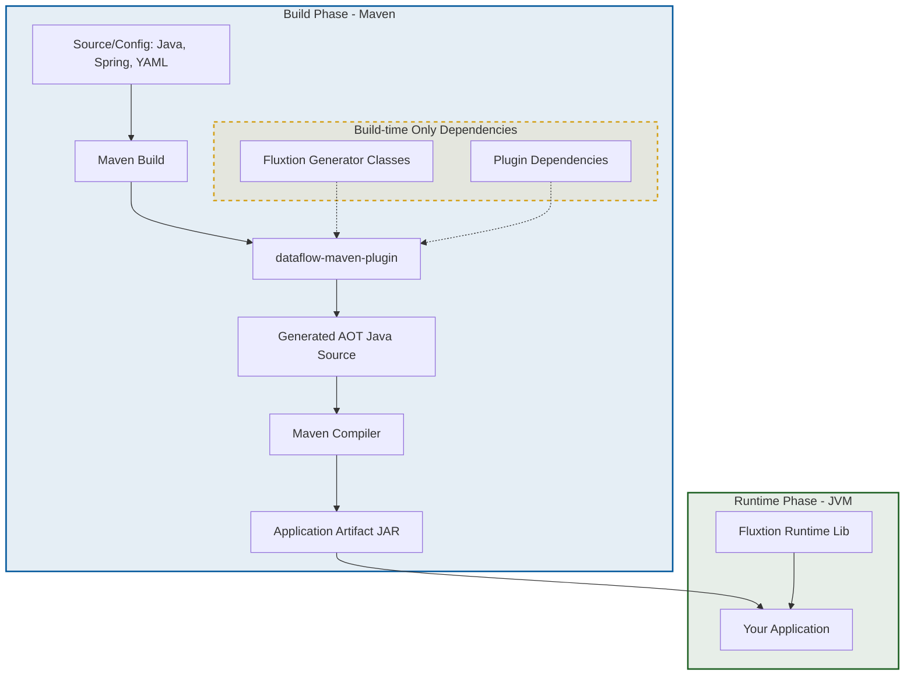

# Fluxtion Maven Plugin Quickstart
---

This quickstart demonstrates how to use the [`dataflow-maven-plugin`](https://github.com/telaminai/fluxtion-mavenplugin)
to generate high-performance, Ahead-of-Time (AOT) compiled event processors as part of your standard Maven build cycle.

## Overview

The `dataflow-maven-plugin` integrates Fluxtion's graph building and code generation tools directly into the Maven lifecycle. It scans your project for graph definitions, generates optimized Java source code, and ensures the generated code is compiled into your final artifact.

## Architecture and Execution Path

The following diagram illustrates how the `dataflow-maven-plugin` fits into the developer's execution path, highlighting the separation between build-time generation and runtime execution.



### Key Concepts

*   **Build-time Generation**: The plugin executes during the Maven `compile` phase, processing your input configurations to generate AOT Java source code.
*   **AOT Source Usage**: Generated source is automatically included in the compilation. Your application code can directly reference these generated classes.
*   **Separation of Concerns**: Generator classes and plugin dependencies are **only required during the build**. They are not needed on the runtime classpath, keeping your application artifact lean.
*   **Runtime Requirements**: At runtime, your application only needs the core Fluxtion runtime library.

---

### 1. Plugin Configuration

Add the `dataflow-maven-plugin` to your `pom.xml`. The `scan` goal is used here to find graph definitions in your compiled classes.

```xml
<plugin>
    <groupId>com.fluxtion.dataflow</groupId>
    <artifactId>dataflow-maven-plugin</artifactId>
    <version>1.2.1</version>
    <executions>
        <execution>
            <goals>
                <goal>scan</goal>
            </goals>
        </execution>
    </executions>
</plugin>
```

### 2. Define the DataFlow

Implement the `FluxtionGraphBuilder` interface to define your event processing graph. The plugin will discover this implementation during the `scan` goal.

```java
package com.telamin.fluxtion.example.compile.maven;

import com.telamin.fluxtion.builder.compile.config.FluxtionCompilerConfig;
import com.telamin.fluxtion.builder.compile.config.FluxtionGraphBuilder;
import com.telamin.fluxtion.builder.generation.config.EventProcessorConfig;
import com.telamin.fluxtion.example.compile.aot.node.PriceLadderPublisher;

public class FluxtionBuilder implements FluxtionGraphBuilder {

    @Override
    public void buildGraph(EventProcessorConfig eventProcessorConfig) {
        // Define the nodes in your graph
        eventProcessorConfig.addNode(new PriceLadderPublisher());
    }

    @Override
    public void configureGeneration(FluxtionCompilerConfig compilerConfig) {
        // Configure the generated class name and package
        compilerConfig.setPackageName("com.telamin.fluxtion.example.compile.maven.generated");
        compilerConfig.setClassName("PriceLadderProcessorAot");
    }
}
```

### 3. Run the Build

Execute the standard Maven compile command:

```bash
mvn compile
```

During the build, the plugin will:

1. Compile your `FluxtionBuilder` class.
2. Scan the output directory (`target/classes`) for `FluxtionGraphBuilder` implementations.
3. Execute the `buildGraph` and `configureGeneration` methods.
4. Generate the `PriceLadderProcessorAot.java` source file in the configured directory.
5. Compile the generated source as part of the project.

### 4. Use the Generated AOT Processor

You can now use the generated class in your application. It implements the standard Fluxtion `DataFlow` interface and any exported services defined in your graph.

```java
import com.telamin.fluxtion.example.compile.maven.generated.PriceLadderProcessorAot;
// ...
PriceLadderProcessorAot processor = new PriceLadderProcessorAot();
processor.init();
processor.start();

// The processor is now ready to handle events or service calls
processor.newPriceLadder(myPriceLadder);
```

### 5. Full Example Code

The complete source for this quickstart can be found in the [Fluxtion Examples repository](https://github.com/telaminai/fluxtion-examples/blob/main/compiler/aot-compiler).

Key files:

*   [pom.xml](https://github.com/telaminai/fluxtion-examples/blob/main/compiler/aot-compiler/pom.xml) - Plugin and dependency configuration.
*   [FluxtionBuilder.java](https://github.com/telaminai/fluxtion-examples/blob/main/compiler/aot-compiler/src/main/java/com/telamin/fluxtion/example/compile/maven/FluxtionBuilder.java) - Graph definition and generation config.
*   [PriceLadderProcessorAot.java](https://github.com/telaminai/fluxtion-examples/blob/main/compiler/aot-compiler/src/main/java/com/telamin/fluxtion/example/compile/maven/generated/PriceLadderProcessorAot.java) - Example of the generated AOT source.
