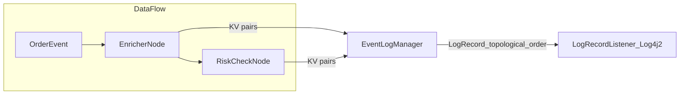

# How-to: Audit logging in a DataFlow (structured logs and tracing)

Fluxtion provides a built-in structured audit logging subsystem for DataFlow graphs. Nodes can emit key/value pairs
(KV) that are aggregated into per-node records and published in the order the graph executes, giving you a clear,
readable, and machine-parseable trace of what happened for each event.

This guide explains:

- How the audit logging subsystem works (EventLogger, EventLogManager, LogRecordListener)
- Structured logging: machine- and human-readable output
- Topological ordering of records to show the execution path
- Tracing versus logging levels (TRACE vs INFO/DEBUG)
- Zero-GC behavior (buffer reuse)
- How to enable it at build time and configure it at runtime
- A runnable example you can study and run

This logging subsystem is implemented as an Auditor in the sense described in the guide:

- See: Monitoring and metrics with Auditors: [monitoring-dataflow-runtime.md](monitoring-dataflow-runtime.md)

## What is emitted and why it’s useful

- Per-node log records composed of KV pairs that the node writes while handling an event
- Records are emitted in topological order, mirroring the execution path through the graph
- Results are both human-readable in logs and safe for downstream machine parsing
- With TRACE enabled, you get a record for every node visited even if it did not add KV pairs

This gives you a simple, low-friction way to:

- Diagnose why a particular decision was made
- Reconstruct the path taken for a given event
- Feed structured data into your log aggregator or SIEM

## How it works

Key runtime components (source code links):

- EventLogManager (auditor that aggregates and emits
  records): [EventLogManager.java]({{fluxtion_src_runtime}}/audit/EventLogManager.java)
- EventLogger (node-local KV writer): [EventLogger.java]({{fluxtion_src_runtime}}/audit/EventLogger.java)
- EventLogSource (nodes that can log): [EventLogSource.java]({{fluxtion_src_runtime}}/audit/EventLogSource.java)
- EventLogNode convenience base: [EventLogNode.java]({{fluxtion_src_runtime}}/audit/EventLogNode.java)
- Control event for level/time
  formatting: [EventLogControlEvent.java]({{fluxtion_src_runtime}}/audit/EventLogControlEvent.java)

!!! info "EventLogger access"
    to receive an EventLogger at runtime your node must either implement EventLogSource or extend
    EventLogNode/NamedBaseNode. If you do neither, the EventLogManager cannot inject a logger and no KV pairs will be
    captured for that node.


Lifecycle:

1. At initialization, EventLogManager registers each EventLogSource and injects an EventLogger into the node.
2. During event processing, nodes write KV pairs to their EventLogger (info/debug/warn/error, plus typed KV helpers).
3. EventLogManager aggregates the KV pairs per node into a structured LogRecord.
4. After processing, records are emitted in topological order via a LogRecordListener that you can attach (e.g., to
   Log4j2).

Mermaid sketch of dataflow and logging path:



Zero-GC note: LogRecord buffers are reused per event cycle and reset after emission, avoiding per-event allocations.

## Node code: writing structured KV pairs

Nodes implement EventLogSource directly or extend EventLogNode/NamedBaseNode so an EventLogger is available.
Excerpt adapted from the demo Enricher node:

```java
public class EnricherNode extends NamedBaseNode {

    private EnrichedOrder lastEnriched;

    @OnEventHandler
    public void onOrder(OrderEvent order) {
        double notional = order.qty() * order.price();
        lastEnriched = new EnrichedOrder(order, notional);
        // Structured logging: node-local KV pairs aggregated by EventLogManager
        auditLog.info("event", order.toString())
                .debug("calc", "enrich")
                .info("symbol", order.symbol())
                .info("notional", String.valueOf(notional))
                .info("enrichedNotional", lastEnriched.notional);
    }
}
```

Notes:

- The node name found in the record corresponds to the instance name in generated code. You can set it for readability.
- Typed KV helpers exist (boolean/int/long/double/char) to avoid conversions.

## Sample YAML log output and topological order

Below is the actual YAML-style record structure captured in the audit-logging-demo (trimmed to a single event). It matches the fields emitted by the demo:

```yaml
eventLogRecord:
    eventTime: 2025-10-10T12:28:20.572+01:00
    logTime: 2025-10-10T12:28:20.572+01:00
    groupingId: null
    event: OrderEvent
    eventToString: OrderEvent{id='o1', symbol='AAPL', qty=100, price=210.5}
    thread: main
    nodeLogs:
        - enricher: { event: OrderEvent{id='o1', symbol='AAPL', qty=100, price=210.5}, symbol: AAPL, notional: 21050.0, enrichedNotional: 21050.0}
        - riskChecker: { calc: risk, orderId: o1, notional: 21050.0, limit.ok: true}
        - simulatedFailer: { calc: fail-check, orderId: o1}
    endTime: 2025-10-10T12:28:20.573+01:00
```

How to read this YAML:

- eventLogRecord: Root object for one processed event’s audit data.
- eventTime: Timestamp near the start of processing for this event (format depends on the configured time formatter).
- logTime: Timestamp when the record was written by the logging pipeline.
- groupingId: Optional correlation/group id if provided by your application; null when not set.
- event: Short event type label.
- eventToString: Full string form of the event for quick human inspection.
- thread: The processing thread name.
- nodeLogs: Ordered list of node outputs in topological execution order. Each list item is a mapping where the key is the node name and the value is that node’s flat KV map.
- endTime: Timestamp at the end of processing for this event.

## Enabling and configuring logging

Build-time wiring (AOT builder): use EventProcessorConfig.addEventAudit(...) to enable logging and set the default
log level. You register nodes as usual, then enable audit logging. For example:

```java
public class AuditLoggingAOTGraphBuilder implements FluxtionGraphBuilder {
    @Override
    public void buildGraph(EventProcessorConfig processorConfig) {
        EnricherNode enricher = new EnricherNode();
        RiskCheckNode risk = new RiskCheckNode(enricher);
        FailWhenIdNode failer = new FailWhenIdNode("FAIL");

        // set instance names to make logs easier to read
        enricher.setName("enricher");
        risk.setName("riskChecker");
        failer.setName("simulatedFailer");

        processorConfig.addNode(enricher);
        processorConfig.addNode(risk);
        processorConfig.addNode(failer);

        // Enable event audit logging at INFO/DEBUG/TRACE etc.
        processorConfig.addEventAudit(EventLogControlEvent.LogLevel.INFO);
    }
}
```

Runtime configuration via DataFlow methods (examples):

```
# Assume df is your generated and initialised DataFlow instance
# Attach a LogRecordListener (here using Log4j2)
Logger logger = LogManager.getLogger("dataflow.order");
df.setAuditLogProcessor(logger::info);

# Switch between INFO/DEBUG/WARN/ERROR and TRACE
# TRACE emits a record for every node visited during processing

df.setAuditLogLevel(EventLogControlEvent.LogLevel.TRACE);

# Optional: customize timestamp formatter used in records
df.setAuditTimeFormatter((sb, epochMillis) ->
        sb.append(DateTimeFormatter.ISO_OFFSET_DATE_TIME
                .format(Instant.ofEpochMilli(epochMillis)
                        .atZone(ZoneId.systemDefault()))));
```

## Logging vs tracing

- Logging (INFO/DEBUG/WARN/ERROR): a record is produced for nodes that logged KV pairs via EventLogger
- Tracing (TRACE): a record is produced for every node visited in the event’s execution path, even if it did not log
- Use TRACE to see the full traversal; drop to INFO/DEBUG in normal operation

## Machine and human readability

- Records are emitted as ordered blocks per event, one per node, so humans can follow the path and KVs
- KVs are unambiguous for machines to parse and index
- With a suitable appender/encoder pattern, downstream systems (ELK, OpenSearch, Splunk) can ingest the KVs directly

## Example: audit-logging-demo

A runnable example demonstrating all of the above is available in the examples repository:

- Module: [audit-logging-demo]({{ config.extra.fluxtion_example_src }}/compiler/audit-logging-demo)
- README: [audit-logging-demo/README.md]({{ config.extra.fluxtion_example_src }}/compiler/audit-logging-demo/README.md)
- Key sources:
    - [EnricherNode.java]({{ config.extra.fluxtion_example_src
      }}/compiler/audit-logging-demo/src/main/java/com/telamin/fluxtion/example/sampleapps/audit/EnricherNode.java)
    - [RiskCheckNode.java]({{ config.extra.fluxtion_example_src
      }}/compiler/audit-logging-demo/src/main/java/com/telamin/fluxtion/example/sampleapps/audit/RiskCheckNode.java)
    - [FailWhenIdNode.java]({{ config.extra.fluxtion_example_src
      }}/compiler/audit-logging-demo/src/main/java/com/telamin/fluxtion/example/sampleapps/audit/FailWhenIdNode.java)
    - [AuditLoggingAOTGraphBuilder.java]({{ config.extra.fluxtion_example_src
      }}/compiler/audit-logging-demo/src/main/java/com/telamin/fluxtion/example/sampleapps/audit/AuditLoggingAOTGraphBuilder.java)
    - [AuditLoggingDemoRunner.java]({{ config.extra.fluxtion_example_src
      }}/compiler/audit-logging-demo/src/main/java/com/telamin/fluxtion/example/sampleapps/audit/AuditLoggingDemoRunner.java)
    - Log4j2 config: [log4j2.yaml]({{ config.extra.fluxtion_example_src
      }}/compiler/audit-logging-demo/src/main/resources/log4j2.yaml)

The demo shows how to wire LogRecordListener to Log4j2, how to switch levels at runtime, and how records appear in
execution order with structured KVs.

## Relation to the Auditor framework

The audit logging subsystem is built as an implementation of the Auditor concept. See the companion guide for the
Auditor model, callbacks, and another monitoring example:

- Guide: [How to monitor a DataFlow at runtime with Auditors](monitoring-dataflow-runtime.md)
- Auditor API (Javadoc): [Fluxtion-runtime Javadoc]({{ config.extra.fluxtion_javadoc }})
- Auditor sources: [com.telamin.fluxtion.runtime.audit]({{fluxtion_src_runtime}}/audit)

## Tips and best practices

- Prefer stable, meaningful node names to make records easier to read and filter
- Use typed KV methods for performance and clarity
- Start with TRACE in dev to validate traversal; reduce to INFO/DEBUG in prod
- Route records to your existing logging pipeline (Log4j2, then to your aggregator)
- Pair with replay/recording for incident analysis

## Troubleshooting

- Not seeing any records? Ensure you called addEventAudit(...) in the builder and attached a LogRecordListener
- Timestamps not in your desired format? Set a custom time formatter via setAuditTimeFormatter
- Want every node recorded? Use TRACE level via setAuditLogLevel

## References

- Runtime sources:
    - [EventLogManager.java]({{fluxtion_src_runtime}}/audit/EventLogManager.java)
    - [EventLogger.java]({{fluxtion_src_runtime}}/audit/EventLogger.java)
    - [EventLogSource.java]({{fluxtion_src_runtime}}/audit/EventLogSource.java)
    - [EventLogNode.java]({{fluxtion_src_runtime}}/audit/EventLogNode.java)
    - [EventLogControlEvent.java]({{fluxtion_src_runtime}}/audit/EventLogControlEvent.java)
- Example module: [audit-logging-demo]({{ config.extra.fluxtion_example_src }}/compiler/audit-logging-demo)
- Related how-to: [Log4j2 setup](logging-setup.md)
- Monitoring with auditors: [monitoring-dataflow-runtime.md](monitoring-dataflow-runtime.md)
