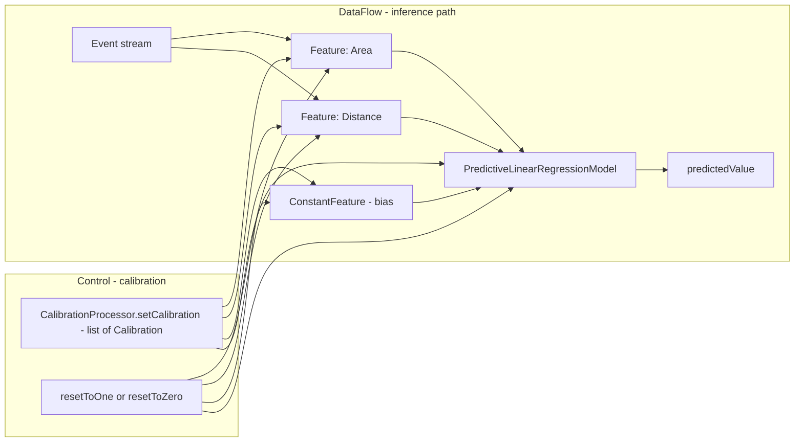
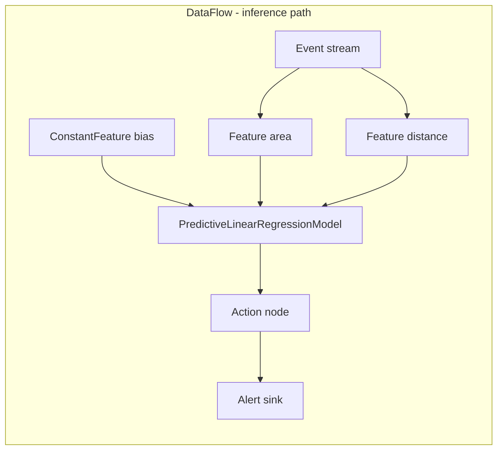

# How-to: Event-driven ML inference with Fluxtion (features, calibration, MLR)

This guide shows how to build a simple, low-latency, event-driven inference pipeline using Fluxtion’s ML primitives.
You will learn how to:

- Define Features from events or flows (including lambdas)
- Build a PredictiveLinearRegressionModel (supports multiple features)
- Add an intercept (bias) using ConstantFeature
- Calibrate features at runtime (by identifier or class)
- Reset calibrations to one/zero and see immediate effects
- Handle out-of-order calibration updates via versioning

The examples match the code in the fluxtion-runtime ML package and the generator-core tests.

## Concepts and APIs

- Feature: a model input with an identifier, friendly name, and current contribution value.
  - Subclass AbstractFeature for event-driven features.
  - Use FlowSuppliedFeature or PropertyToFeature to bind features to a FlowSupplier.
- PredictiveLinearRegressionModel: sums Feature.value() across all features to produce predictedValue().
- Calibration: a runtime message that updates a feature’s coefficient and weight.
  - Target by featureIdentifier (string) or by featureClass (defaults to class simple name).
  - Includes featureVersion: higher or equal versions are applied; lower versions are ignored.
- CalibrationProcessor: service interface used to setCalibration, resetToOne, and resetToZero.
- ConstantFeature: a built-in constant-1 feature, acting as model intercept.

Mermaid overview of the data path and calibration control plane:



Notes:

- Features recompute their contribution immediately when they receive a calibration or reset (no new data needed).
- The model recomputes its sum when calibrations/resets are applied, so predictedValue() updates right away.

## Minimal model with one feature

```java
import com.telamin.fluxtion.Fluxtion;
import com.telamin.fluxtion.runtime.DataFlow;
import com.telamin.fluxtion.runtime.ml.PredictiveLinearRegressionModel;
import com.telamin.fluxtion.runtime.ml.AbstractFeature;
import com.telamin.fluxtion.runtime.annotations.OnEventHandler;

// Build the DataFlow using Fluxtion.compile(...)
DataFlow sep = Fluxtion.compile(c -> 
        c.addNode(new PredictiveLinearRegressionModel(new AreaFeature()), "predictiveModel"));

// Event-driven feature using AbstractFeature
public static class AreaFeature extends AbstractFeature {
    @OnEventHandler
    public boolean onHouse(HouseDetails house) {
        // Set the raw signal; AbstractFeature maintains contribution as raw * coefficient * weight
        return updateFromRaw(house.getArea());
    }
}
```

Calibrate by class (uses default identifier AreaFeature):

```java
import com.telamin.fluxtion.runtime.ml.CalibrationProcessor;
import com.telamin.fluxtion.runtime.ml.Calibration;
import java.util.List;

sep.getExportedService(CalibrationProcessor.class).setCalibration(List.of(
    Calibration.builder()
        .featureClass(AreaFeature.class)
        .co_efficient(1.5)
        .weight(2)
        .featureVersion(1)
        .build()
));
```

## Features from a FlowSupplier (lambda extractors)

```java
import com.telamin.fluxtion.Fluxtion;
import com.telamin.fluxtion.runtime.DataFlow;
import com.telamin.fluxtion.builder.DataFlowBuilder;
import com.telamin.fluxtion.runtime.flowfunction.FlowSupplier;
import com.telamin.fluxtion.runtime.ml.*;

DataFlow sep = Fluxtion.compile(c -> {
    FlowSupplier<HouseDetails> flow = DataFlowBuilder.subscribe(HouseDetails.class).flowSupplier();
    c.addNode(new PredictiveLinearRegressionModel(
            PropertyToFeature.build("area", flow, HouseDetails::getArea),
            PropertyToFeature.build("distance", flow, HouseDetails::getDistance)
    ), "predictiveModel");
});
```

Calibrate by explicit identifier:

```java
sep.getExportedService(CalibrationProcessor.class).setCalibration(List.of(
    Calibration.builder().featureIdentifier("area").co_efficient(2).weight(1).featureVersion(3).build(),
    Calibration.builder().featureIdentifier("distance").co_efficient(1).weight(1).featureVersion(3).build()
));
```

## Adding an intercept (bias)

Add a ConstantFeature to the model and set its coefficient to the desired bias value:

```java
import com.telamin.fluxtion.Fluxtion;
import com.telamin.fluxtion.runtime.DataFlow;
import com.telamin.fluxtion.builder.DataFlowBuilder;
import com.telamin.fluxtion.runtime.flowfunction.FlowSupplier;
import com.telamin.fluxtion.runtime.ml.*;

DataFlow sep = Fluxtion.compile(c -> {
    FlowSupplier<HouseDetails> flow = DataFlowBuilder.subscribe(HouseDetails.class).flowSupplier();
    c.addNode(new PredictiveLinearRegressionModel(
            new ConstantFeature(),
            PropertyToFeature.build("area", flow, HouseDetails::getArea)
    ), "predictiveModel");
});

sep.getExportedService(CalibrationProcessor.class).setCalibration(List.of(
    Calibration.builder().featureClass(ConstantFeature.class).co_efficient(3.0).weight(1.0).featureVersion(1).build()
));
// predictedValue() will be 3.0 until data arrives; then bias + sum(features)
```

## Resets and immediate effects

Use resetToZero to disable all features (including bias), and resetToOne to restore neutral scaling:

```java
CalibrationProcessor svc = sep.getExportedService(CalibrationProcessor.class);
svc.resetToZero();   // predictedValue() updates immediately
svc.resetToOne();    // predictedValue() updates immediately using last observed raw values
```

Implementation details:

- AbstractFeature stores the last raw signal, recalculating contribution on calibration/reset.
- If a feature hasn’t seen data yet, resetToZero sets contribution to 0; later resets will recompute when raw becomes available.

## Versioning and out-of-order updates

Features ignore calibrations that have a lower featureVersion than the last applied value.
This guards against out-of-order delivery. Equality is accepted (idempotent reapply).

```java
// Apply version 10
svc.setCalibration(List.of(Calibration.builder().featureIdentifier("area").co_efficient(2).weight(1).featureVersion(10).build()));
// Out-of-order older update -> ignored
svc.setCalibration(List.of(Calibration.builder().featureIdentifier("area").co_efficient(100).weight(100).featureVersion(9).build()));
```

## Full example

```java
import com.telamin.fluxtion.Fluxtion;
import com.telamin.fluxtion.runtime.DataFlow;
import com.telamin.fluxtion.builder.DataFlowBuilder;
import com.telamin.fluxtion.runtime.flowfunction.FlowSupplier;
import com.telamin.fluxtion.runtime.ml.*;

DataFlow sep = Fluxtion.compile(c -> {
    FlowSupplier<HouseDetails> flow = DataFlowBuilder.subscribe(HouseDetails.class).flowSupplier();
    c.addNode(new PredictiveLinearRegressionModel(
            new ConstantFeature(),
            PropertyToFeature.build("area", flow, HouseDetails::getArea),
            PropertyToFeature.build("distance", flow, HouseDetails::getDistance)
    ), "predictiveModel");
});

PredictiveModel predictiveModel = sep.getNodeById("predictiveModel");
CalibrationProcessor svc = sep.getExportedService(CalibrationProcessor.class);

svc.setCalibration(List.of(
    Calibration.builder().featureClass(ConstantFeature.class).co_efficient(5).weight(1).featureVersion(1).build(),
    Calibration.builder().featureIdentifier("area").co_efficient(1.5).weight(2).featureVersion(1).build(),
    Calibration.builder().featureIdentifier("distance").co_efficient(1).weight(1).featureVersion(1).build()
));

// Before data -> bias only
assert predictiveModel.predictedValue() == 5;

sep.onEvent(new HouseDetails(10, 2));
// Prediction: 5 + (10*1.5*2) + (2*1*1) = 5 + 30 + 2 = 37
assert predictiveModel.predictedValue() == 37;

svc.resetToZero(); // -> 0
svc.resetToOne();  // -> uses last raw values: 1*10 + 1*2 + 1*1 = 13
```

## Tips

- Choose clear feature identifiers when using lambda-based features to simplify calibration.
- Use ConstantFeature for an intercept; you can also define multiple constants for step-changes or regime flags.
- Keep coefficient as the trained parameter and use weight for operational calibration if you want separation of concerns.

## Acting on inference: wiring application actions

Often you want to take action based on the prediction (e.g., emit an alert, write to a sink, or drive a control loop). You can add an application node that depends on the model and triggers when the model updates.

Mermaid sketch:



Example node taking action above a threshold:

```java
import com.telamin.fluxtion.runtime.annotations.OnTrigger;
import com.telamin.fluxtion.runtime.annotations.builder.AssignToField;
import com.telamin.fluxtion.runtime.ml.PredictiveModel;
import java.util.function.DoubleConsumer;

public final class AlertOnThreshold {

    private final PredictiveModel model;
    private final double threshold;
    private final DoubleConsumer onAlert;

    public AlertOnThreshold(
            @AssignToField("model") PredictiveModel model,
            @AssignToField("threshold") double threshold,
            @AssignToField("onAlert") DoubleConsumer onAlert) {
        this.model = model;
        this.threshold = threshold;
        this.onAlert = onAlert;
    }

    // Triggers whenever upstream dependencies (the model) update
    @OnTrigger
    public boolean onPredictionUpdated() {
        double y = model.predictedValue();
        if (!Double.isNaN(y) && y >= threshold) {
            onAlert.accept(y);
        }
        // No need to propagate further by default
        return false;
    }
}
```

Wiring it into your graph:

```java
import com.telamin.fluxtion.Fluxtion;
import com.telamin.fluxtion.runtime.DataFlow;
import com.telamin.fluxtion.builder.DataFlowBuilder;
import com.telamin.fluxtion.runtime.flowfunction.FlowSupplier;
import com.telamin.fluxtion.runtime.ml.*;

DataFlow sep = Fluxtion.compile(c -> {
    FlowSupplier<HouseDetails> flow = DataFlowBuilder.subscribe(HouseDetails.class).flowSupplier();
    PredictiveLinearRegressionModel m = new PredictiveLinearRegressionModel(
            new ConstantFeature(),
            PropertyToFeature.build("area", flow, HouseDetails::getArea)
    );
    c.addNode(m, "model");
    c.addNode(new AlertOnThreshold(m, 30.0, v -> System.out.println("ALERT: prediction=" + v)), "alert");
});
```

Notes:

- The action node declares a dependency on the model by holding a reference; Fluxtion wires the dependency so that the action node's @OnTrigger method is called after the model updates.
- Replace the DoubleConsumer with your own sink (Kafka producer, database writer, actuator control, etc.).

## Source links

- [PredictiveLinearRegressionModel.java]({{fluxtion_src_runtime}}/ml/PredictiveLinearRegressionModel.java)
- [Feature.java]({{fluxtion_src_runtime}}/ml/Feature.java)
- [AbstractFeature.java]({{fluxtion_src_runtime}}/ml/AbstractFeature.java)
- [FlowSuppliedFeature.java]({{fluxtion_src_runtime}}/ml/FlowSuppliedFeature.java)
- [PropertyToFeature.java]({{fluxtion_src_runtime}}/ml/PropertyToFeature.java)
- [MapPropertyToFeature.java]({{fluxtion_src_runtime}}/ml/MapPropertyToFeature.java)
- [ConstantFeature.java]({{fluxtion_src_runtime}}/ml/ConstantFeature.java)
- [Calibration.java]({{fluxtion_src_runtime}}/ml/Calibration.java)
- [CalibrationProcessor.java]({{fluxtion_src_runtime}}/ml/CalibrationProcessor.java)
