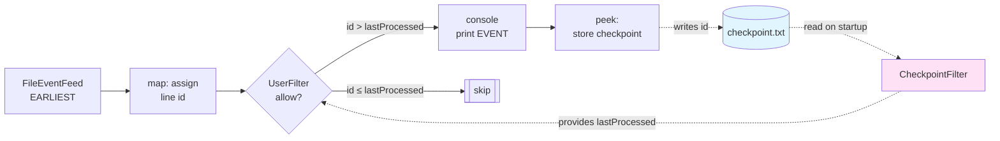
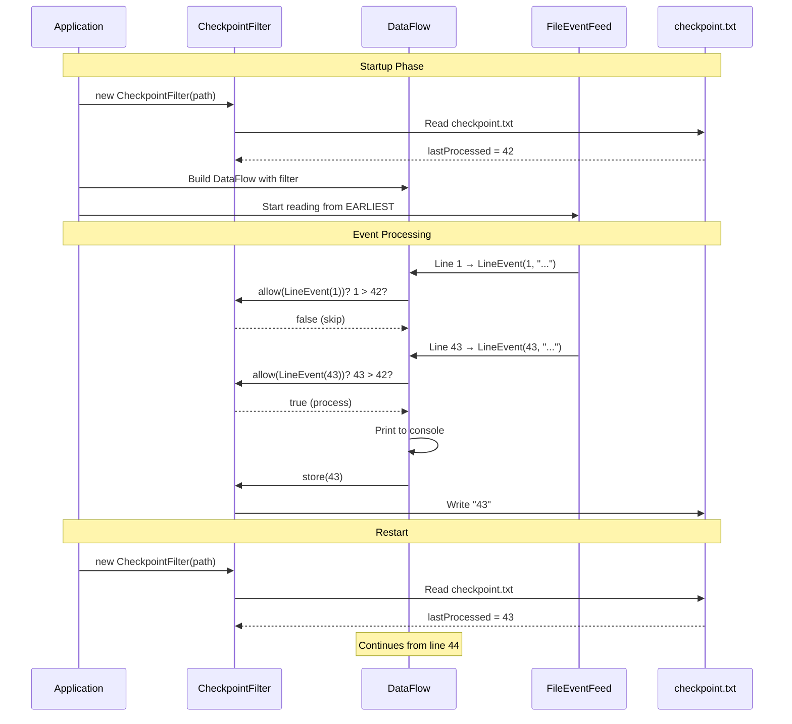

# How to Manage State and Recovery

This guide explains how to implement state management and recovery in Fluxtion DataFlow applications. You'll learn how to persist state externally, enable restart recovery, and leverage service injection for swappable persistence mechanisms.

## Overview

Fluxtion DataFlows are **stateless graphs by design**. The graph structure describes how events flow and transform, but it doesn't inherently store application state. This separation is intentional and provides several benefits:

- **Testability**: Pure business logic without persistence concerns
- **Flexibility**: State management strategy is completely under your control
- **Scalability**: External state stores can be distributed, replicated, or sharded
- **Simplicity**: Clear boundary between event processing and state persistence

For a complete working example, see the [State Checkpoint Demo]({{fluxtion_example_src}}/sample-apps/state-checkpoint-demo) sample application.

## Key Concepts

### External State Management

In Fluxtion, state is managed by **user-provided classes** that:

1. Track the state you need (offsets, checkpoints, aggregated values, etc.)
2. Provide methods to read and write that state
3. Handle persistence to your chosen storage mechanism (files, databases, distributed caches)

The DataFlow graph remains stateless while your state management objects handle all persistence concerns.

### Recovery on Restart

When your application restarts:

1. State management objects reload their previous state from persistent storage
2. Event feeds can replay from the last checkpoint
3. Your DataFlow continues processing from where it left off

This pattern enables **fault tolerance** without baking persistence logic into the event processing graph.

## Why Use External State Objects

### Separation of Concerns

Business logic in your DataFlow remains pure and focused:

```java
// DataFlow: pure transformation logic
DataFlow dataFlow = DataFlowBuilder.subscribeToFeed("fileFeed", String.class)
    .map(s -> new LineEvent(lineCounter.incrementAndGet(), s))
    .filter(userFilter::allow)  // Business rule: skip already-processed
    .console("EVENT: {}")
    .peek(le -> checkpoint.store(le.id()))  // Checkpoint: external concern
    .build();
```

State management is handled externally:

```java
// External state objects created before DataFlow
CheckpointFilter checkpoint = new CheckpointFilter(checkpointPath);
UserFilter userFilter = new UserFilter(checkpoint);
```

### Testability

Without external dependencies baked into the graph, testing becomes straightforward:

- Mock state services for unit tests
- Use in-memory state for fast test execution
- Swap file persistence for database persistence without changing DataFlow code

### Flexibility

You control every aspect of state management:

- **What to persist**: Offsets, aggregates, feature flags, configuration
- **When to persist**: After each event, batched, time-based
- **Where to persist**: Local files, Redis, PostgreSQL, S3, distributed KV stores
- **How to serialize**: JSON, Protobuf, plain text, binary

## Service Injection with @ServiceRegistered

While the state-checkpoint-demo shows manual instantiation, Fluxtion provides a powerful pattern for **injecting services at runtime** using the `@ServiceRegistered` annotation.

### The Pattern

User objects in the DataFlow can declare dependencies on services that are injected at runtime:

```java
public class MyStateManager {
    private PersistenceService persistenceService;
    
    @ServiceRegistered
    public void persistenceRegistered(PersistenceService service, String serviceName) {
        this.persistenceService = service;
        System.out.println("Persistence service registered: " + serviceName);
    }
    
    public void saveState(int checkpoint) {
        persistenceService.write("checkpoint", checkpoint);
    }
}
```

The host application registers the service implementation:

```java
DataFlow dataFlow = DataFlowBuilder
    .subscribeToNode(new MyStateManager())
    .build();

// Inject file-based persistence
dataFlow.registerService(new FilePersistence(), PersistenceService.class, "file-store");

// Or swap to database persistence without changing DataFlow code
dataFlow.registerService(new DatabasePersistence(), PersistenceService.class, "db-store");
```

### Benefits of Service Injection

1. **Swappable implementations**: Change persistence mechanisms without recompiling the DataFlow
2. **Environment-specific configuration**: Use files in development, databases in production
3. **Simplified testing**: Mock services in tests, real implementations in production
4. **Loose coupling**: DataFlow depends on interfaces, not concrete implementations

See the [Service Registered guide](../reference/service/service-registered.md) for more details.

## State Checkpoint Demo Walkthrough

Let's examine the complete [State Checkpoint Demo]({{fluxtion_example_src}}/sample-apps/state-checkpoint-demo) to see these concepts in action.

### What the Demo Does

The application:

1. Reads lines from a text file using `FileEventFeed`
2. Assigns a sequential ID (line number) to each line
3. Uses a `UserFilter` to skip lines already processed in previous runs
4. Prints accepted events to the console
5. Persists the last processed ID to a checkpoint file
6. On restart, resumes from the last checkpoint

### Architecture



### Key Classes

#### LineEvent.java - Immutable Event

```java
public record LineEvent(int id, String line) {}
```

A simple immutable POJO carrying the line number and text content.

#### CheckpointFilter.java - State Persistence

```java
public class CheckpointFilter {
    private final Path checkpointFile;
    private final AtomicInteger lastProcessed = new AtomicInteger(0);

    public CheckpointFilter(String checkpointFilePath) {
        this.checkpointFile = Path.of(checkpointFilePath);
        // Read checkpoint on startup
        if (Files.exists(checkpointFile)) {
            String s = Files.readString(checkpointFile).trim();
            if (!s.isEmpty()) {
                lastProcessed.set(Integer.parseInt(s));
            }
        }
    }

    public int lastProcessed() {
        return lastProcessed.get();
    }

    public synchronized void store(int id) {
        lastProcessed.set(id);
        Files.writeString(checkpointFile, Integer.toString(id));
    }
}
```

**Key points**:

- Loads checkpoint on construction (recovery on restart)
- Provides `lastProcessed()` for filtering
- `store()` method persists to disk
- Uses simple text file format (easily swappable for database)

#### UserFilter.java - Business Logic

```java
public class UserFilter {
    private final CheckpointFilter checkpoint;

    public UserFilter(CheckpointFilter checkpoint) {
        this.checkpoint = checkpoint;
    }

    public boolean allow(LineEvent e) {
        return e.id() > checkpoint.lastProcessed();
    }
}
```

**Key points**:

- Pure business logic: "allow events not yet processed"
- Depends on checkpoint service via constructor injection
- No knowledge of persistence mechanism (file, database, etc.)

#### StateCheckpointDemo.java - Wiring It Together

```java
public class StateCheckpointDemo {
    public static void main(String[] args) {
        String inputPath = args.length > 0 ? args[0] : "./data/input.txt";
        String checkpointPath = args.length > 1 ? args[1] : "./data/checkpoint.txt";

        // Create file feed
        FileEventFeed inputFileFeed = new FileEventFeed(
            inputPath,
            "fileFeed",
            ReadStrategy.EARLIEST  // Replay from start
        );

        // External state objects
        CheckpointFilter checkpoint = new CheckpointFilter(checkpointPath);
        UserFilter userFilter = new UserFilter(checkpoint);

        // Line counter for assigning IDs
        AtomicInteger lineCounter = new AtomicInteger(0);

        // Build DataFlow
        DataFlow dataFlow = DataFlowBuilder
            .subscribeToFeed("fileFeed", String.class)
            .map(s -> new LineEvent(lineCounter.incrementAndGet(), s))
            .filter(userFilter::allow)
            .console("EVENT: {}")
            .peek(le -> checkpoint.store(le.id()))
            .build();

        // Wire and start
        DataFlowConnector runner = new DataFlowConnector();
        runner.addDataFlow(dataFlow);
        runner.addFeed(inputFileFeed);
        runner.start();
    }
}
```

**Key points**:

- State objects (`checkpoint`, `userFilter`) created **before** DataFlow
- FileEventFeed uses `EARLIEST` strategy to replay all lines
- Checkpoint filter decides which lines to process
- `peek()` saves checkpoint after successful processing

### Sequence of Operations



## Running the Demo

### Build and Run

From the fluxtion-examples repository root:

```bash
# Build
mvn -q -pl sample-apps/state-checkpoint-demo -am package

# Run with default paths
mvn -q -pl sample-apps/state-checkpoint-demo exec:exec

# Or run the jar directly
java --add-opens=java.base/jdk.internal.misc=ALL-UNNAMED \
  -jar sample-apps/state-checkpoint-demo/target/state-checkpoint-demo-*-jar-with-dependencies.jar
```

### Using Helper Scripts

The demo includes convenience scripts:

```bash
cd sample-apps/state-checkpoint-demo

# Run in foreground
./start.sh

# Run in background
./start.sh --bg

# Custom paths
./start.sh --input ./data/myInput.txt --checkpoint ./data/myCheckpoint.txt

# Stop background process
./stop.sh
```

### Observing Recovery

1. **First run**: The app generates lines every 3 seconds and prints them with IDs:
   ```
   EVENT: LineEvent[id=1, line=Generated @ 2025-10-09T07:26:01.234]
   EVENT: LineEvent[id=2, line=Generated @ 2025-10-09T07:26:04.236]
   EVENT: LineEvent[id=3, line=Generated @ 2025-10-09T07:26:07.239]
   ```

2. **Stop the app** (Ctrl+C or `./stop.sh`)

3. **Restart**: The app resumes from the next ID:
   ```
   EVENT: LineEvent[id=4, line=Generated @ 2025-10-09T07:28:12.101]
   EVENT: LineEvent[id=5, line=Generated @ 2025-10-09T07:28:15.104]
   ```

4. **Delete checkpoint**: Remove `./data/checkpoint.txt` and restart. The app starts from ID 1 again.

## Implementation Patterns

### Pattern 1: Simple File Checkpoint

**Use when**: Development, simple use cases, human-readable state

```java
public class FileCheckpoint {
    private final Path file;
    private int value;
    
    public FileCheckpoint(String path) {
        this.file = Path.of(path);
        if (Files.exists(file)) {
            value = Integer.parseInt(Files.readString(file).trim());
        }
    }
    
    public void save(int newValue) {
        this.value = newValue;
        Files.writeString(file, String.valueOf(newValue));
    }
}
```

**Pros**: Simple, readable, no dependencies  
**Cons**: Not suitable for distributed systems, limited to single machine

### Pattern 2: Database Checkpoint

**Use when**: Production, distributed systems, transactional requirements

```java
public class DatabaseCheckpoint {
    private final DataSource dataSource;
    private final String key;
    
    public DatabaseCheckpoint(DataSource ds, String checkpointKey) {
        this.dataSource = ds;
        this.key = checkpointKey;
    }
    
    public int load() {
        try (Connection conn = dataSource.getConnection();
             PreparedStatement stmt = conn.prepareStatement(
                 "SELECT value FROM checkpoints WHERE key = ?")) {
            stmt.setString(1, key);
            ResultSet rs = stmt.executeQuery();
            return rs.next() ? rs.getInt("value") : 0;
        }
    }
    
    public void save(int value) {
        try (Connection conn = dataSource.getConnection();
             PreparedStatement stmt = conn.prepareStatement(
                 "INSERT INTO checkpoints (key, value) VALUES (?, ?) " +
                 "ON CONFLICT (key) DO UPDATE SET value = ?")) {
            stmt.setString(1, key);
            stmt.setInt(2, value);
            stmt.setInt(3, value);
            stmt.executeUpdate();
        }
    }
}
```

**Pros**: Distributed, transactional, scalable  
**Cons**: Requires database setup, more complex

### Pattern 3: Redis Checkpoint

**Use when**: High-throughput, distributed, low-latency requirements

```java
public class RedisCheckpoint {
    private final JedisPool pool;
    private final String key;
    
    public RedisCheckpoint(JedisPool pool, String checkpointKey) {
        this.pool = pool;
        this.key = checkpointKey;
    }
    
    public int load() {
        try (Jedis jedis = pool.getResource()) {
            String value = jedis.get(key);
            return value != null ? Integer.parseInt(value) : 0;
        }
    }
    
    public void save(int value) {
        try (Jedis jedis = pool.getResource()) {
            jedis.set(key, String.valueOf(value));
        }
    }
}
```

**Pros**: Fast, distributed, simple API  
**Cons**: Eventually consistent, requires Redis infrastructure

### Pattern 4: Service Interface with @ServiceRegistered

**Use when**: Need to swap implementations, testing, environment-specific config

```java
// Define interface
public interface CheckpointService {
    int load();
    void save(int value);
}

// Use in DataFlow node
public class StatefulProcessor {
    private CheckpointService checkpoint;
    
    @ServiceRegistered
    public void checkpointRegistered(CheckpointService service) {
        this.checkpoint = service;
        // Restore state on startup
        int lastValue = service.load();
        System.out.println("Restored checkpoint: " + lastValue);
    }
    
    @OnEventHandler
    public boolean process(MyEvent event) {
        // Business logic
        checkpoint.save(event.getId());
        return true;
    }
}

// Host application chooses implementation
DataFlow dataFlow = DataFlowBuilder
    .subscribeToNode(new StatefulProcessor())
    .build();

// Development: use file-based
dataFlow.registerService(
    new FileCheckpointService("./checkpoint.txt"), 
    CheckpointService.class
);

// Production: use Redis
dataFlow.registerService(
    new RedisCheckpointService(redisPool, "app:checkpoint"), 
    CheckpointService.class
);

// Testing: use in-memory mock
dataFlow.registerService(
    new InMemoryCheckpointService(), 
    CheckpointService.class
);
```

**Pros**: Maximum flexibility, testable, environment-agnostic  
**Cons**: Requires interface design upfront

## Best Practices

### 1. Keep State Objects Simple

State management objects should be focused on persistence, not business logic:

```java
// Good: focused on persistence
public class Checkpoint {
    public int load() { /* ... */ }
    public void save(int value) { /* ... */ }
}

// Bad: mixing persistence and business logic
public class Checkpoint {
    public boolean shouldProcess(Event e) { /* business logic here */ }
    public void save(int value) { /* ... */ }
}
```

### 2. Initialize State on Startup

Load checkpoints in constructors or `@ServiceRegistered` methods:

```java
public class MyProcessor {
    private int lastProcessed;
    
    @ServiceRegistered
    public void checkpointRegistered(CheckpointService service) {
        // Restore state immediately
        this.lastProcessed = service.load();
    }
}
```

### 3. Handle Persistence Failures Gracefully

Don't let persistence errors crash your DataFlow:

```java
public void save(int value) {
    try {
        Files.writeString(file, String.valueOf(value));
    } catch (IOException e) {
        // Log error but don't throw - allows processing to continue
        logger.error("Failed to save checkpoint", e);
        // Consider: dead letter queue, retry logic, metrics
    }
}
```

### 4. Make Checkpoint Paths Configurable

Accept paths/keys as constructor parameters or configuration:

```java
// Good: configurable
public Checkpoint(String path) { /* ... */ }

// Bad: hardcoded
public Checkpoint() {
    this.file = Path.of("/tmp/checkpoint.txt");
}
```

### 5. Use Atomic Operations

Ensure checkpoint updates are atomic to avoid partial state:

```java
public synchronized void save(int value) {
    this.lastProcessed.set(value);
    Files.writeString(file, String.valueOf(value));
}
```

### 6. Consider Batching for High Throughput

For high-throughput applications, batch checkpoint updates:

```java
private final AtomicInteger pendingCheckpoint = new AtomicInteger();
private final ScheduledExecutorService scheduler = Executors.newSingleThreadScheduledExecutor();

public void checkpoint(int value) {
    pendingCheckpoint.set(value);
}

// Flush every second
scheduler.scheduleAtFixedRate(() -> {
    int value = pendingCheckpoint.get();
    Files.writeString(file, String.valueOf(value));
}, 1, 1, TimeUnit.SECONDS);
```

### 7. Test with Mock Services

Use service injection to simplify testing:

```java
@Test
void testWithMockCheckpoint() {
    CheckpointService mockCheckpoint = Mockito.mock(CheckpointService.class);
    when(mockCheckpoint.load()).thenReturn(42);
    
    DataFlow dataFlow = DataFlowBuilder
        .subscribeToNode(new MyProcessor())
        .build();
    
    dataFlow.registerService(mockCheckpoint, CheckpointService.class);
    
    // Test business logic without real persistence
}
```

## Comparison with Other Frameworks

### Kafka Streams

Kafka Streams manages state internally with state stores:

```java
// Kafka Streams: state built into framework
StreamsBuilder builder = new StreamsBuilder();
KTable<String, Long> counts = builder.stream("input")
    .groupByKey()
    .count(Materialized.as("counts-store"));  // State store
```

**Fluxtion approach**: You control state externally:

```java
// Fluxtion: explicit external state
StateStore store = new StateStore("counts-store");
DataFlow dataFlow = DataFlowBuilder.subscribe(String.class)
    .peek(s -> store.increment(s))
    .build();
```

**Trade-offs**:
- Kafka Streams: Integrated, but tightly coupled to Kafka
- Fluxtion: Flexible, works with any storage, explicit boundaries

### Flink

Flink uses checkpointing with operator state:

```java
// Flink: framework-managed checkpointing
stream.keyBy(...)
      .process(new KeyedProcessFunction<>() {
          private ValueState<Long> state;
          // Framework handles checkpointing
      });
```

**Fluxtion approach**: User-managed checkpointing:

```java
// Fluxtion: explicit checkpoint control
CheckpointService checkpoint = new FileCheckpoint("./checkpoint");
DataFlow dataFlow = DataFlowBuilder.subscribe(Event.class)
    .peek(e -> checkpoint.save(e.getId()))
    .build();
```

**Trade-offs**:
- Flink: Automatic, but requires Flink infrastructure
- Fluxtion: Explicit, but simpler and more portable

## Common Pitfalls

### Pitfall 1: Checkpointing Before Success

**Problem**: Saving state before confirming downstream processing succeeded

```java
// Bad: checkpoint first
.peek(e -> checkpoint.save(e.getId()))
.map(this::mightFail)  // If this fails, we've already checkpointed!
```

**Solution**: Checkpoint after all processing

```java
// Good: checkpoint last
.map(this::process)
.peek(e -> checkpoint.save(e.getId()))
```

### Pitfall 2: Not Handling Missing Checkpoints

**Problem**: Assuming checkpoint file always exists

```java
// Bad: crashes if file doesn't exist
public Checkpoint(String path) {
    this.value = Integer.parseInt(Files.readString(Path.of(path)));
}
```

**Solution**: Provide sensible defaults

```java
// Good: handles missing file
public Checkpoint(String path) {
    Path file = Path.of(path);
    if (Files.exists(file)) {
        this.value = Integer.parseInt(Files.readString(file).trim());
    } else {
        this.value = 0;  // Start from beginning
    }
}
```

### Pitfall 3: Mutable Checkpoint References

**Problem**: Passing mutable state directly to DataFlow nodes

```java
// Bad: shared mutable state
AtomicInteger counter = new AtomicInteger();
DataFlow df1 = builder.peek(e -> counter.incrementAndGet()).build();
DataFlow df2 = builder.peek(e -> counter.incrementAndGet()).build();
// Race conditions between dataflows!
```

**Solution**: Encapsulate state in checkpoint objects

```java
// Good: each DataFlow has its own checkpoint
Checkpoint cp1 = new Checkpoint("flow1.txt");
Checkpoint cp2 = new Checkpoint("flow2.txt");
```

## Summary

Fluxtion's approach to state management provides:

1. **Clear separation**: DataFlow graphs remain stateless; state is managed externally
2. **Flexibility**: You choose what, when, where, and how to persist
3. **Testability**: Mock state services for fast, deterministic tests
4. **Service injection**: Use `@ServiceRegistered` to swap implementations seamlessly
5. **Recovery**: Load checkpoints on startup to resume from last known state
6. **Simplicity**: No framework magic, just plain Java objects

The [State Checkpoint Demo]({{fluxtion_example_src}}/sample-apps/state-checkpoint-demo) demonstrates these principles in a working application. Use it as a starting point for your own state management strategy.

## Related Resources

- [State Checkpoint Demo source code]({{fluxtion_example_src}}/sample-apps/state-checkpoint-demo)
- [Service Registered guide](../reference/service/service-registered.md) - Detailed @ServiceRegistered documentation
- [Service Introduction](../reference/service/introduction.md) - Overview of service patterns
- [Unit Testing DataFlow guide](unit-testing-dataflow.md) - How to test with mock services
- [DataFlow Connector](../integration/dataflow-connector.md) - Wiring DataFlows with event feeds
