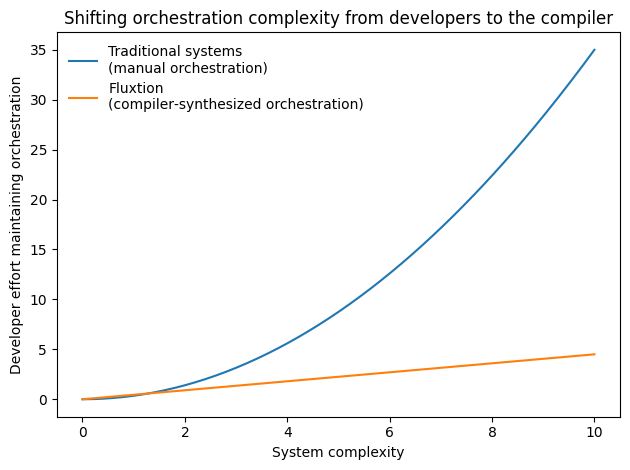
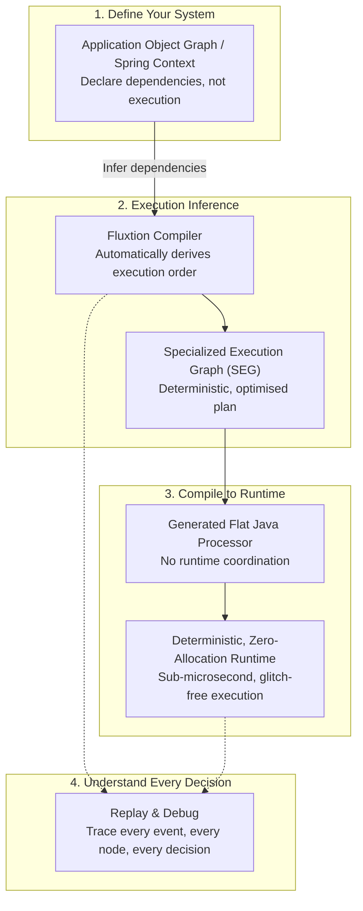
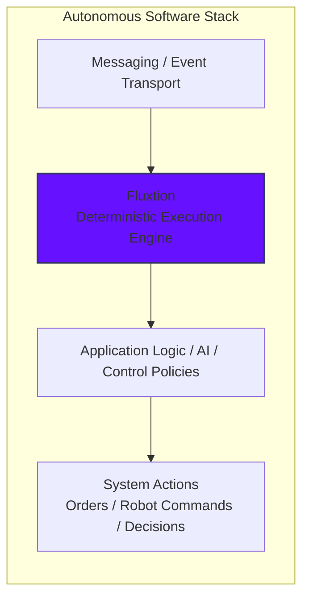

# Fluxtion

## Stop debugging event systems. Start compiling them 

**Replace reactive pipelines with a deterministic execution engine. Build predictable, replayable, and auditable systems with Fluxtion**

Instead of resolving coordination at runtime, Fluxtion derives execution paths from structure at compile time.

Build low-latency, stateful systems with predictable coordination — no runtime plumbing.

👉 **No runtime reactive chains**
👉 **No hidden async behaviour**
👉 **No per-event allocation**

---

## Why it matters: The Plumbing Tax

Most event-driven systems pay a hidden cost:

* Dynamic dispatch through operator chains.
* Coordination logic spread across pipelines.
* Per-event allocation and GC pressure.
* Unpredictable execution order in complex graphs.

This is the **plumbing tax**. Fluxtion removes it by moving coordination from **runtime → compile time**.

### Scaling without the complexity

As systems grow, handwritten orchestration code becomes complex and fragile. Fluxtion removes this burden, allowing
effort to scale with business logic, not orchestration complexity.



In reactive systems, coordination code grows with graph complexity. In Fluxtion, coordination cost stays constant — it
is compiled once, not executed per event.

---

## What Fluxtion is

Fluxtion is a compiler for deterministic execution.

Instead of interpreting a runtime graph (like RxJava or Kafka Streams), Fluxtion:

1. **Analyses** your object graph at build time.
2. **Derives** a topologically ordered execution plan.
3. **Generates** a flat, specialised dispatcher with no runtime graph traversal or dynamic routing.

Like a spreadsheet, only the affected parts of the system recompute when inputs change — in a fixed, predictable
order. The result is a system that behaves as a **continuous decision engine** — reacting to
events with predictable, replayable logic.

Fluxtion uses a deterministic [Event-Oriented Programming](home/event-oriented-programming.md) model, where
execution paths are derived from system structure at compile time rather than resolved dynamically at runtime. Each
event follows a precomputed path, producing predictable, low-latency behaviour without runtime dispatch overhead.




---

## What you get

* ⚡ **Low and predictable latency**: Compiled dispatch eliminates runtime interpretation overhead (tens of nanoseconds
  for typical in-process pipelines).
* 🧠 **Deterministic execution**: Events are processed in a fixed, topological order — no glitches, no surprises.
* ♻️ **Zero-allocation hot path**: Performs no framework allocation during dispatch, ensuring stable tail latency.
* 📉 **Stable tail latency**: Fewer GC pauses and flatter p99/p99.9 behavior.
* 💰 **Lower infrastructure cost**: Higher throughput per core means fewer instances and reduced cloud spend.
* 🧩 **Less coordination code**: No zip, merge, share, or manual wiring — the graph is inferred automatically.

---

## Add capability with one line

```java
@Inject
FraudDetectionModel fraudModel;
```

One line integrates an entire subsystem:

* dozens of nodes
* ML models
* timers
* state
* dependencies

Fluxtion doesn’t just add a component.
It integrates an entire execution graph.

* No wiring
* No orchestration
* No coordination code


---

## Trust through predictability

A deterministic system is one where the same sequence of inputs always produces the same sequence of outputs. In
event-driven software, this means the order and timing of execution are guaranteed, not left to the whims of thread
scheduling or race conditions.

* **Replay**: Exactly reproduce any production scenario by replaying the input event stream.
* **Debugging**: Eliminate "heisenbugs." If a bug happens once, it happens every time you replay that trace.
* **Observability**: Gain clear insight into state transitions. The execution graph provides a map of exactly how an
  event propagated.
* **Safety**: Essential for systems where errors have physical or financial consequences (finance, robotics, AI).
* **Auditability**: Deterministic execution provides a foundation for explainable decisions and regulatory compliance.

Because execution is derived from structure, system behaviour is not just observable — it is mechanically guaranteed.

---

## Verified system behaviour

Deterministic execution makes system behaviour not just predictable, but verifiable.

Because execution is reproducible:

* changes can be tested against real production event streams
* behaviour can be compared before and after modification
* the impact of a change can be understood before deployment

This allows systems to move from:

“tested and deployed”
to
“verified and trusted”

---

## Continuous Decision Systems

### The Missing Layer in the Software Stack

Modern stacks manage compute, transport, and data, but still rely on handwritten orchestration to coordinate continuous
decision systems. Fluxtion introduces a deterministic runtime model that removes the need for handwritten orchestration
logic.



### Ideal for:

* **Trading and pricing systems**: High-frequency execution where ordering and consistency are critical.
* **Robotics and Control**: Real-time control loops where jitter or out-of-order execution can cause failure.
* **AI/Agent Coordination**: Deterministic orchestration of stateful components, including emerging agent-style systems.

---

## How it works

1. **Define** your processing nodes as plain Java classes.
2. **Declare** dependencies between them (or use the DSL).
3. **Compile**: Fluxtion builds a Specialized Execution Graph (SEG).
4. **Run**: The compiler generates a typed, flat dispatcher.

No runtime graph traversal. No dynamic coordination.

Shared downstream computation across event paths is factored at compile time, producing minimal execution schedules that
avoid redundant recomputation and improve CPU efficiency through better instruction cache locality and predictable
branching.

---

## What it replaces

Fluxtion is not another stream processor — it replaces how you coordinate logic inside your application.

| Instead of                        | Use Fluxtion for                              |
|:----------------------------------|:----------------------------------------------|
| **RxJava / Reactor pipelines**    | Deterministic in-process event coordination   |
| **Kafka Streams (embedded)**      | Ultra-low-latency, non-Kafka-bound processing |
| **Callback chains / event buses** | Structured, validated execution graphs        |

👉 **[Detailed comparison: Fluxtion vs RxJava and Kafka Streams](reference/alternative-comparisons.md)**

---

## Simple event pipeline

Install [Jbang](https://www.jbang.dev/documentation/jbang/latest/installation.html) and run a simple event pipeline
example (Java 25):

You define the transformations. Fluxtion builds the execution path.

```java
//DEPS com.telamin.fluxtion:fluxtion-builder:{{fluxtion_version}}
//JAVA 25

import com.telamin.fluxtion.builder.DataFlowBuilder;
import com.telamin.fluxtion.runtime.DataFlow;

record Trade(double price, int size) {}

void main() {
    DataFlow tradeFlow = DataFlowBuilder
            .subscribe(Trade.class)
            .map(t -> t.price() * t.size()) // compute trade value
            .filter(v -> v > 500)           // risk threshold check
            .console("large trade value: {}")
            .build();

    tradeFlow.onEvent(new Trade(100, 3));
    tradeFlow.onEvent(new Trade(100, 10));
    tradeFlow.onEvent(new Trade(45, 10));
    tradeFlow.onEvent(new Trade(55, 10));
}
```

This looks like a stream pipeline, but Fluxtion compiles it into a flat, deterministic execution path — it is not
interpreted at runtime.

Run: `jbang tradeFilter.java`

Output:

```text
large trade value: 1000.0
large trade value: 550.0
```

**[Quickstart Guide](home/quickstart.md)** | **[Performance Benchmarks](reference/performance.md)**

---

## When to use Fluxtion

* ✅ **Deterministic** event processing is required.
* ✅ **Low-latency** in-process coordination is a priority.
* ✅ **Replayable logic** is needed for debugging and testing.
* ✅ You have complex dependency graphs that are hard to maintain manually.

### When NOT to use it

* ❌ You need **distributed** scaling across clusters (use Flink/Spark).
* ❌ You need **Kafka-native** durable state recovery.
* ❌ You want **SQL-first** analytics pipelines.

---

## Get started

Stop writing orchestration code and start building logic.

* Read the **[Quickstart Guide](home/quickstart.md)**
* Explore the **[Why Fluxtion](home/why-fluxtion.md)** guide
* Learn about **[Running Fluxtion with Mongoose](home/fluxtion-with-mongoose.md)**
* Start the **[Run Fluxtion in Mongoose](getting-started/run-fluxtion-in-mongoose.md)** tutorial
* View the project on **[GitHub](https://github.com/telaminai/fluxtion)**

!!! note "Java Compatibility"
Fluxtion supports Java 21+. Examples use Java 25 for concise, project-less execution via Jbang.
