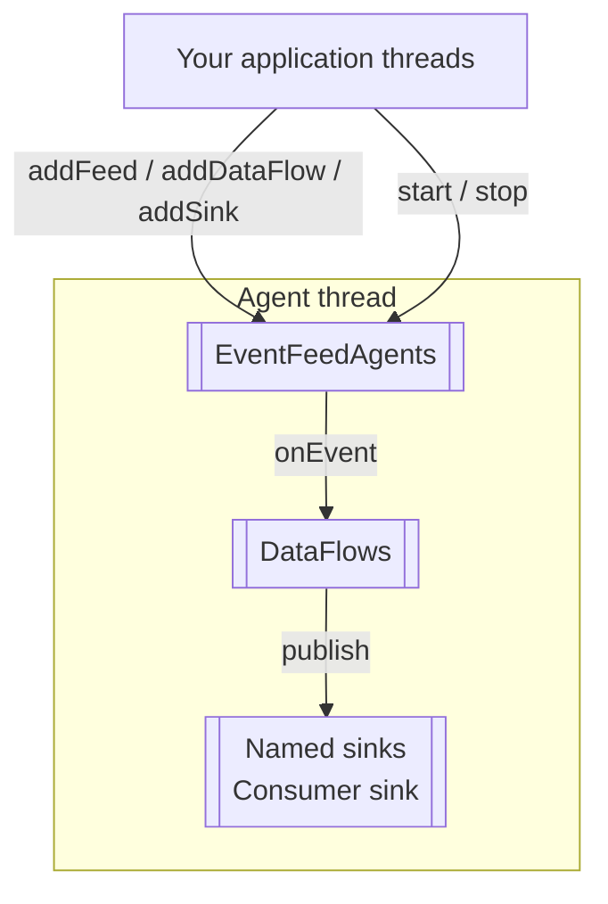
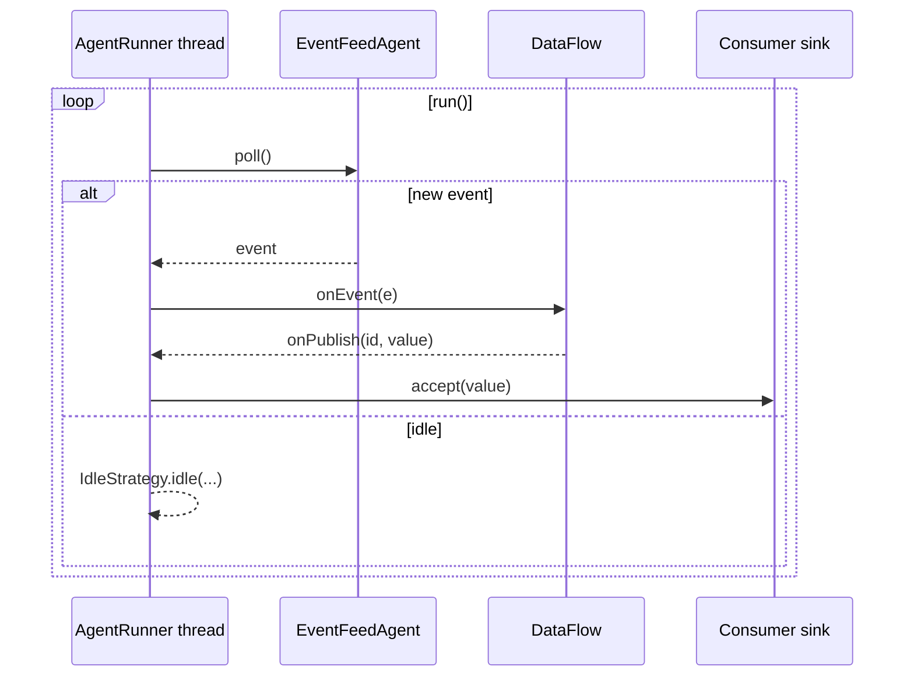
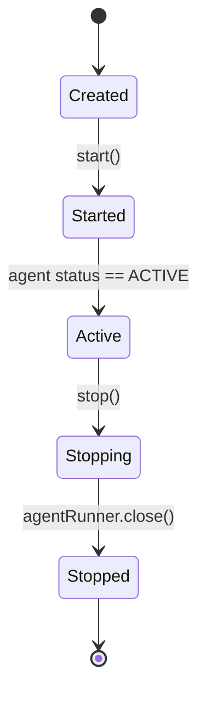

# DataFlowConnector guide

This guide explains how to use DataFlowConnector—a simple integration utility—to wire EventFeedAgents into one or more DataFlows and deliver results
to external sinks. It covers purpose, threading model, composing feeds/flows/sinks, idle/throughput tuning (
IdleStrategy), lifecycle, and error handling.

For a complete runnable example, see: [Embedding a DataFlow with a file feed and file sink](../sample-apps/embedding-dataflow-file-feed-sink-demo.md). That page shows a concrete end‑to‑end setup (file → DataFlow → file) that uses the same patterns described here.

## What is DataFlowConnector?

DataFlowConnector is a small runtime integration utility that brokers events from EventFeedAgent sources into DataFlow instances and
then fans out results to user‑provided sinks. It provides:

- Composition: add and remove feeds, dataflows, and named sinks at runtime.
- Threading: runs the feed→flow→sink loop on a dedicated AgentRunner thread.
- Back‑pressure/idle control: pluggable IdleStrategy for balancing latency vs. CPU.
- Lifecycle: start/stop orchestration for all attached components.
- Error handling: central hook for uncaught exceptions raised on the runner thread.

Relevant class: [DataFlowConnector](https://javadoc.io/doc/com.telamin.fluxtion/fluxtion-runtime/latest/com/telamin/fluxtion/runtime/connector/DataFlowConnector.html)

## Architecture overview


## Runtime sequence (poll loop)


## Lifecycle states


## When to use it

Use DataFlowConnector when you:

- Embed Fluxtion into an application and want a simple “wiring surface” to plug feeds into flows and publish results to
  sinks.
- Need a managed thread that polls feeds and drives DataFlows without writing your own loop.
- Want to share one thread across multiple feeds and flows while still being able to add/remove components dynamically.

If you need fine‑grained control over threads or bespoke schedulers, you can manage EventFeedAgent and DataFlow
instances yourself; DataFlowConnector just packages a pragmatic default.

## Threading model

- Single runner thread: Internally, DataFlowConnector creates an Agrona AgentRunner with a WorkDynamicCompositeAgent
  that integrates feeds and flows. All onEvent, DataFlow execution, and sink publication callbacks happen on this
  dedicated thread.
- User thread safety: Your sinks and any shared application state must be thread‑safe if they interact with other
  threads. The DataFlow code itself executes single‑threaded on the runner.
- Backpressure: Feeds are polled on the runner thread. A slow sink or long‑running flow stage will slow the entire loop.
  Use small, non‑blocking sinks or hand off to another executor inside the sink if necessary.

## Composing feeds, flows, and sinks

You can add multiple feeds and multiple flows. Sinks are named and can be referenced by id from your DataFlow graph.

Typical setup:

```java
import com.telamin.fluxtion.runtime.DataFlow;
import com.telamin.fluxtion.runtime.connector.DataFlowConnector;
import com.telamin.fluxtion.runtime.eventfeed.EventFeedAgent;

public class ExampleWiring {
    public static void main(String[] args) {
        var connector = new DataFlowConnector();

        // 1) Feeds (sources)
        EventFeedAgent<String> fileFeed = /* create your feed (e.g., FileEventFeed) */ null;
        connector.addFeed(fileFeed);

        // 2) DataFlows (processing)
        DataFlow flow = DataFlow.subscribe("fileFeed")
                .console("in:{}")
                .map(String::toUpperCase)
                .console("out:{}")
                .sink("fileSink");
        connector.addDataFlow(flow);

        // 3) Sinks (targets)
        java.util.function.Consumer<String> fileSink = s -> {/* append to file */};
        connector.addSink("fileSink", fileSink);

        // 4) Start/stop lifecycle
        connector.start();
        // ... run ...
        connector.stop();
    }
}
```

Notes:

- addFeed/removeFeed: Register or detach an EventFeedAgent<?>.
- addDataFlow/removeDataFlow: Register or detach a DataFlow pipeline.
- addSink/removeSink: Register a named Consumer<T> that a DataFlow can publish to via sink("id"). The generic type T
  should match the DataFlow’s output type for that sink.

## IdleStrategy and throughput/latency tuning

The runner uses an org.agrona.concurrent.IdleStrategy to control how it behaves between units of work. DataFlowConnector
defaults to a back‑off strategy tuned for moderate latency without burning a CPU when idle:

```java
import org.agrona.concurrent.BackoffIdleStrategy;
import org.agrona.concurrent.IdleStrategy;

public class IdleDefaults {
    public IdleStrategy buildDefault() {
        return new BackoffIdleStrategy(10, 10, 1_000_000, 1_000_000_000);
    }
}
```

You can customize it to suit your deployment:

- Low latency, higher CPU:
    - BusySpinIdleStrategy (very low latency, will consume a core at idle)
    - NoOpIdleStrategy (tight loop, similar caveats)
- Balanced:
    - BackoffIdleStrategy (default) – ramps from spinning to yielding to parking.
- Power efficient:
    - SleepingIdleStrategy – trades latency for reduced CPU when idle.

Construct with a custom strategy:

```java
import com.telamin.fluxtion.runtime.connector.DataFlowConnector;
import org.agrona.concurrent.IdleStrategy;
import org.agrona.concurrent.SleepingIdleStrategy;

public class CustomIdleExample {
    public DataFlowConnector build() {
        IdleStrategy strategy = new SleepingIdleStrategy(1); // 1 ms sleep when idle
        return new DataFlowConnector(strategy);
    }
}
```

## Lifecycle

- start():
    - Starts the AgentRunner on its own thread if not already started.
    - Waits until the internal agent reports ACTIVE before returning.
- stop():
    - Closes the AgentRunner and releases the thread. Idempotent.
- Dynamic wiring:
    - You can call addFeed/addDataFlow/addSink both before and after start(). Removing components is also supported at
      runtime.

Best practices:

- Create and wire feeds/flows/sinks first, then start().
- If you alter wiring dynamically at runtime, ensure your feeds and sinks are prepared for handover (e.g., releasing old
  file handles) and that you don’t remove a sink that a running flow still targets.

## Error handling

DataFlowConnector lets you supply a Consumer<Throwable> error handler that is invoked for uncaught exceptions on the
runner thread:

```java
import com.telamin.fluxtion.runtime.connector.DataFlowConnector;
import org.agrona.concurrent.BackoffIdleStrategy;

public class ErrorHandlingExample {
    private static final java.util.logging.Logger log = java.util.logging.Logger.getLogger("app");

    public DataFlowConnector build() {
        return new DataFlowConnector(
                new BackoffIdleStrategy(10, 10, 1_000_000, 1_000_000_000),
                t -> log.severe("Unhandled error in dataflow loop: " + t.getMessage())
        );
    }
}
```

Details:

- The connector logs the error at SEVERE and forwards the Throwable to your handler.
- Errors thrown by your sinks or flow callbacks will surface here. You can decide whether to crash the process, alert,
  or attempt recovery.
- If your handler throws, it will propagate to the runner; prefer defensive logging and controlled shutdown.

Recommendations:

- Keep sink code small and robust; validate inputs and handle I/O errors.
- Use circuit breakers or buffering when writing to slow or unreliable destinations.

## Using the sample project as a template

The sample application demonstrates the full path: file → DataFlow → file. Review it to see:

- A concrete EventFeedAgent (FileEventFeed) tailing an input file.
- A DataFlow that logs the input, upper‑cases it, logs again, and publishes to a sink id.
- A sink (FileMessageSink) that appends to an output file.

See: [Embedding a DataFlow with a file feed and file sink](../sample-apps/embedding-dataflow-file-feed-sink-demo.md).

That sample provides:

- A shaded, runnable jar with a Main class.
- Scripts to start/stop the app.
- A simple way to drive events by appending lines to the input file, then verifying the output file.

## Operational tips

- Observability:
    - Use the provided slf4j-simple (test) or your logger in prod to record lifecycle and errors from your handler.
    - Consider counting processed events and failures in your sinks.
- Throughput vs. latency:
    - Favor BusySpin or tighter Backoff stages for ultra‑low latency; prefer Sleeping for resource‑constrained
      environments.
- Graceful shutdown:
    - Call stop() and wait for file/sockets in feeds/sinks to close before exiting.
- Isolation:
    - If one flow is CPU heavy, consider a separate connector (and thread) for it.

## Minimal API reference

- addFeed(EventFeedAgent<?> feed): DataFlowConnector – register a source.
- removeFeed(EventFeedAgent<?> feed): DataFlowConnector – deregister a source.
- addDataFlow(DataFlow dataFlow): DataFlowConnector – register a processing graph.
- removeDataFlow(DataFlow dataFlow): DataFlowConnector – deregister a graph.
- addSink(String id, Consumer<T> sink): DataFlowConnector – register a named sink used by DataFlow.sink("id").
- removeSink(String id): DataFlowConnector – remove a sink.
- start(): DataFlowConnector – start the runner thread and wait for ACTIVE.
- stop(): DataFlowConnector – stop the runner.

## Next steps

- Start from the sample app and adapt the feed to your source (TCP, Kafka, files, timers).
- Add more DataFlows to branch processing for different topics or message types.
- Register multiple sinks (e.g., console + file + REST client) under different ids and publish to them selectively from
  flows.
