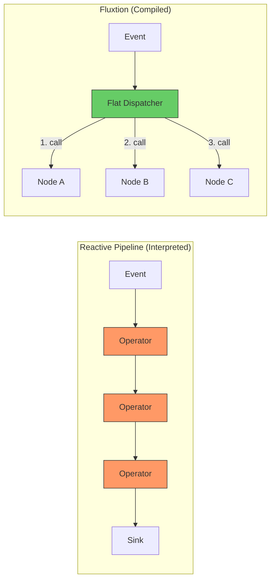

# Fluxtion vs RxJava and Kafka Streams

Fluxtion is not another streaming library.

It replaces how event-driven logic is **coordinated inside your application**.

This page compares Fluxtion with two common approaches:

* **RxJava / Reactor** — reactive pipelines
* **Kafka Streams** — embedded stream processing

---

# The core difference

## Runtime vs compiled coordination

Fluxtion moves coordination from **runtime → compile time**.



|                 | Fluxtion                     | RxJava / Reactor          | Kafka Streams               |
| --------------- | ---------------------------- | ------------------------- | --------------------------- |
| Execution model | **Compiled execution graph** | Runtime operator chain    | Runtime topology over Kafka |
| Coordination    | **Inferred at build time**   | Manually defined          | Defined via DSL             |
| Dispatch        | **Direct method calls**      | Dynamic operator dispatch | Processor topology          |
| Determinism     | **Guaranteed**               | Emergent                  | Partition-based             |

👉 Fluxtion moves coordination from **runtime → compile time**

---

# Mental model

## Fluxtion

* Define dependencies between components
* Compiler derives execution order
* Single deterministic execution pass

## RxJava / Reactor

* Chain operators (`map`, `filter`, `zip`)
* Events flow through a pipeline
* Coordination emerges at runtime

## Kafka Streams

* Define stream topology
* Process events across Kafka topics
* Scale via partitions and brokers

---

# Same logic, different execution

### RxJava

```java
PublishSubject<Trade> trades = PublishSubject.create();

trades
    .map(t -> t.price * t.size)
    .filter(v -> v > 500)
    .subscribe(v -> System.out.println(v));
```

### Fluxtion

```java
DataFlow flow = DataFlowBuilder
    .subscribe(Trade.class)
    .map(t -> t.price() * t.size())
    .filter(v -> v > 500)
    .console("{}")
    .build();
```

### What changes

* RxJava executes this pipeline **at runtime**
* Fluxtion **compiles it into a flat execution path**

👉 Same logic — different cost model

---

# Performance and latency

|                   | Fluxtion                | RxJava                | Kafka Streams                  |
| ----------------- | ----------------------- | --------------------- | ------------------------------ |
| Dispatch overhead | **Very low (compiled)** | Per-operator overhead | Higher (serialization + Kafka) |
| Allocation        | **0 B/op possible**     | Per-event allocation  | Significant                    |
| Tail latency      | **Stable**              | GC-driven spikes      | Network + GC                   |

👉 Fluxtion’s advantage grows with:

* branching
* joins
* filtering
* multiple event types

---

# Determinism and correctness

|                   | Fluxtion                | RxJava                  | Kafka Streams          |
| ----------------- | ----------------------- | ----------------------- | ---------------------- |
| Execution order   | **Fixed (topological)** | Emergent                | Partition-dependent    |
| Glitch-free joins | **Guaranteed**          | Manual (`share`, `zip`) | Managed but complex    |
| Replayability     | **Exact replay**        | Difficult               | Partial (Kafka replay) |

---

# Complexity and developer effort

## Reactive pipelines

As systems grow, developers must manage:

* subscription graphs
* shared streams (`share`)
* joins (`zip`, `merge`)
* filtering interactions
* ordering bugs

This coordination logic grows with system complexity.

---

## Fluxtion

* dependencies declared once
* execution inferred automatically
* no manual wiring
* no hidden behaviour

👉 Coordination cost stays **constant per node**

---

# Multiple event types

|                     | Fluxtion     | RxJava           | Kafka Streams   |
| ------------------- | ------------ | ---------------- | --------------- |
| Multi-type handling | **Built-in** | Separate streams | Separate topics |
| Dispatch cost       | **O(1)**     | Per stream       | Per topic       |

---

# Where Fluxtion wins

Use Fluxtion when:

* latency matters (microseconds / nanoseconds)
* deterministic execution is required
* systems must be replayable and debuggable
* coordination complexity is becoming a bottleneck
* you are replacing complex RxJava pipelines

Typical use cases:

* trading systems
* real-time decision engines
* edge processing
* embedded analytics
* complex moduliths

---

# Where RxJava is a better fit

Use RxJava / Reactor when:

* you need async composition (IO, futures)
* pipelines are simple and linear
* flexibility matters more than determinism
* latency is not critical

---

# Where Kafka Streams is a better fit

Use Kafka Streams when:

* you need distributed scaling
* Kafka is your system backbone
* you need durable state and replay via topics
* latency requirements are in milliseconds

---

# The real difference

## Reactive systems

Define *how events flow*

## Fluxtion

Defines *what depends on what*
Compiler determines *how it runs*

---

# The plumbing tax

In reactive systems, developers must:

* wire joins (`zip`)
* manage sharing (`share`)
* reason about subscription graphs
* debug emergent behaviour

In Fluxtion:

* dependencies are declared once
* execution is inferred
* coordination code disappears

---

# Summary

|               | Fluxtion                              | RxJava           | Kafka Streams            |
| ------------- | ------------------------------------- | ---------------- | ------------------------ |
| Category      | **Deterministic coordination engine** | Reactive library | Stream processing engine |
| Best for      | Low-latency decision systems          | Async pipelines  | Distributed streaming    |
| Core strength | Compile-time execution                | Flexibility      | Scalability              |

---

# Bottom line

Fluxtion doesn’t try to replace everything.

It replaces the **hardest part of event-driven systems**:

👉 coordinating logic correctly, efficiently, and predictably

---

👉 For production runtime concerns (threading, feeds, lifecycle), see **[Running Fluxtion with Mongoose](../home/fluxtion-with-mongoose.md)**

👉 Have deeper questions? [See the Fluxtion FAQ](faq.md)
