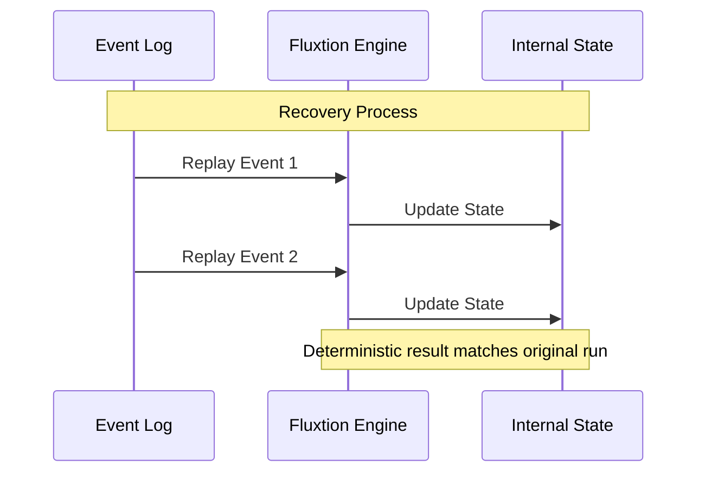
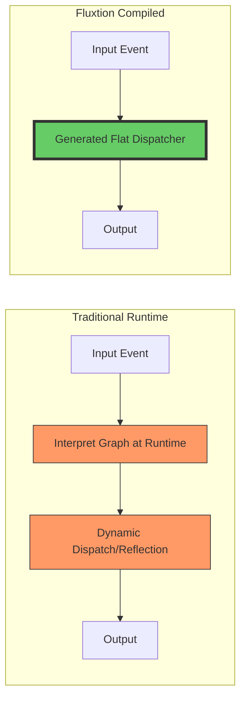

# Fluxtion FAQ: Common questions and tradeoffs

Answers to common questions from engineers evaluating Fluxtion’s execution model, performance, and tradeoffs.

These questions focus on areas where Fluxtion differs most from reactive pipelines and traditional event-driven architectures.

---

## Why not just build this in C++ or Rust?

In some domains, teams do exactly that — especially when they need full control over memory and execution.

In practice, most systems balance **latency, safety, and development speed**.

Fluxtion is designed to provide:

* very low-latency dispatch (often in the tens of nanoseconds for in-process pipelines)
* deterministic behaviour
* strong tooling and safety from the JVM ecosystem

Because Fluxtion compiles execution graphs into bytecode, it can leverage the JVM’s JIT optimisations while avoiding most runtime coordination overhead.

This allows teams to achieve low-latency execution without the development and maintenance cost typically associated with lower-level languages.

---

## How do you handle state recovery if the process crashes?

Fluxtion is designed around **deterministic execution**, which enables a different recovery strategy from snapshot-based systems.

Instead of persisting internal state, you can:

1. Persist the input event stream
2. Recreate the processor
3. Replay events to rebuild state

Because execution order is fixed, replaying the same event sequence produces the same state and outputs.

This approach:

* avoids complex snapshot management
* simplifies recovery logic
* works especially well for systems with event sourcing or durable input logs

For systems that require faster recovery, hybrid approaches (checkpoints + replay) can also be used.

### State Replay Model

---

## Does AOT compilation make the system harder to change?

In practice, it tends to do the opposite.

In dynamic systems, many wiring and coordination issues only appear at runtime.
In Fluxtion, these are validated at build time.

The compiler:

* detects missing dependencies
* enforces execution ordering
* prevents invalid graph structures

This shifts errors **from runtime failures → build-time validation**.

As a result, systems are often easier to evolve, because changes can be validated before deployment.

---

## How does Fluxtion compare to async frameworks?

Fluxtion is designed for deterministic, in-process execution — not asynchronous composition.

Frameworks like RxJava or Reactor are optimized for:

* IO-bound workflows
* concurrency and scheduling

Fluxtion is optimized for:

* predictable execution order
* low-latency processing
* coordination of stateful logic

In practice, they can be used together:

* async frameworks handle IO
* Fluxtion handles decision logic

---

## If Fluxtion uses Spring, does it inherit Spring’s runtime overhead?

No.

Fluxtion can use Spring configuration or annotations as a **graph discovery mechanism** — to understand dependencies between components.

After that:

* the graph is compiled
* the runtime is generated
* Spring is not required for execution

The resulting processor:

* contains no Spring runtime
* uses no reflection
* uses no proxies

You get the convenience of Spring-style configuration with a **lean, compiled runtime**.

---

## How does Fluxtion scale across multiple machines?

Fluxtion is designed for **in-process execution**, not distributed orchestration.

It focuses on making a **single node fast, predictable, and deterministic**.

In a typical architecture:

* Kafka, Pulsar, or other systems handle data movement between services
* Fluxtion handles decision-making within each service

Fluxtion integrates with runtimes such as [Mongoose](../home/fluxtion-with-mongoose.md) which handle the distributed transport and multi-threaded execution environment.

This separation works well in practice:

* distributed systems move data
* Fluxtion executes logic efficiently inside each node

Improving single-node efficiency often reduces the need for additional infrastructure.

---

## Is this just dependency injection with a different name?

No — although it builds on similar concepts.

Traditional dependency injection:

* wires components together
* ensures dependencies are available

Fluxtion goes further:

* analyses how data flows between components
* derives execution order
* generates the dispatcher that runs the system

So instead of just wiring objects, Fluxtion defines and compiles the execution model itself.

### Compiled vs Runtime Flow

---

## What is the operational and business value of adopting Fluxtion?

Beyond technical performance, Fluxtion provides strategic value in three key areas:

- **Cost Efficiency**: Processing 50M+ events per second on a single core allows for massive infrastructure consolidation. Higher throughput per core means fewer servers, reduced cloud spend, and lower energy consumption.
- **Audit and Compliance**: Deterministic execution ensures that the same inputs always produce the same outputs. This enables exact forensic replay, explainable decision-making, and easier regulatory compliance in high-stakes industries like finance or healthcare.
- **Operational Simplicity**: By moving coordination from runtime to compile-time, Fluxtion eliminates "heisenbugs" caused by race conditions or unpredictable thread scheduling. Replayable logic simplifies root-cause analysis and reduces time-to-recovery for production incidents.

---

## When should I not use Fluxtion?

Fluxtion is not intended for every use case.

You may prefer other tools if you need:

* distributed stream processing across clusters (Flink, Spark)
* Kafka-native state management and recovery
* SQL-based stream processing
* dynamic runtime composition of processing graphs

Fluxtion is most effective when:

* execution must be deterministic
* latency matters
* coordination complexity is high
* logic runs inside a single process
