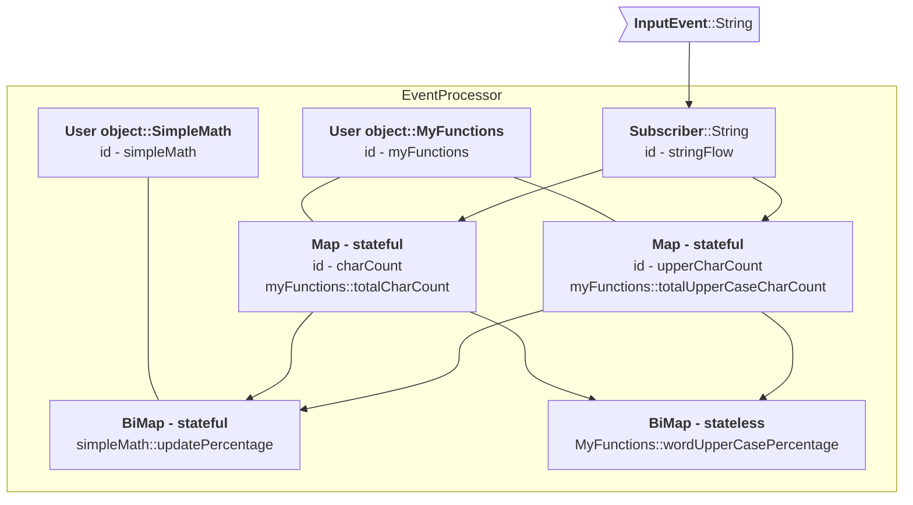

#  DataFlow
---

A DataFlow is a live structure where new events trigger a set of dispatch operations. We create a DataFlow with:

```java
DataFlowBuilder.[subscribe operation].build()
```


### Subscribe to event

To create a flow for String events, call  `DataFlowBuilder.subscribe(String.class)`, any call to processor.onEvent("myString") will be 
routed to this flow.

```java
DataFlow.subscribe(String.class);
```

Once a flow has been created map, filter, groupBy, etc. functions can be applied as chained calls.

```java
public static void main(String[] args) {
    DataFlow processor = DataFlowBuilder
            .subscribe(String.class)
            .console("string in {}")
            .build();

    processor.onEvent("AAA");
    processor.onEvent("BBB");
}
```

Running the example code above logs to console

```console
string in AAA
string in BBB
```

###Map
A map operation takes the output from a parent node and then applies a function to it. If the return of the
function is null then the event notification no longer propagates down that path.

```java
DataFlow.subscribe(String.class)
        .map(String::toLowerCase);
```

**Map supports**

- Stateless functions
- Stateful functions
- Primitive specialisation
- Method references

```java
public static void main(String[] args) {
    DataFlow processor = DataFlowBuilder
            .subscribe(String.class)
            .map(String::toLowerCase)
            .console("string in {}")
            .build();

    processor.onEvent("AAA");
    processor.onEvent("BBB");
}
```

Running the example code above logs to console

```console
string mapped aaa
string mapped bbb
```

### BiMap
Two data flows can be mapped with a bi map function. Both flows must have triggered at least once for the bimap function
to be invoked

```java
public static void main(String[] args) {
    var strings = DataFlowBuilder.subscribe(String.class);
    
    var ints = DataFlowBuilder.subscribe(Integer.class);
    
    DataFlow processor = DataFlowBuilder
            .mapBiFunction((a, b) -> Integer.parseInt(a) + b, strings, ints)
            .console("biMap ans: {}")
            .build();

    processor.onEvent("500");
    processor.onEvent(55);
}
```

Running the example code above logs to console

```console
biMap ans: 555
```

###Default value
A default value can be assigned to any flow. This can be useful when calculating a bi map function and one data flow
argument is optional

```java
public static void main(String[] args) {
    var strings = DataFlowBuilder
            .subscribe(String.class)
            .defaultValue("200");
    
    var ints = DataFlowBuilder.subscribe(Integer.class);
    
    DataFlow processor = DataFlowBuilder
            .mapBiFunction((a, b) -> Integer.parseInt(a) + b, strings, ints)
            .console("biMap with default value ans: {}")
            .build();
    processor.onEvent(55);
}
```

Running the example code above logs to console

```console
biMap with default value ans: 255
```

### Filter
A filter predicate can be applied to a node to control event propagation, true continues the propagation and false swallows
the notification. If the predicate returns true then the input to the predicate is passed to the next operation in the
event processor.

```java
DataFlow
    .subscribe(Integer.class)
    .filter(i -> i > 10);
```

**Filter supports**

- Stateless functions
- Stateful functions
- Primitive specialisation
- Method references
- Inline lambdas - **interpreted mode only support, AOT mode will not serialise the inline lambda**

```java
public static void main(String[] args) {
    DataFlow processor = DataFlowBuilder
            .subscribe(Integer.class)
            .filter(i -> i > 10)
            .console("int {} > 10 ")
            .build();

    processor.onEvent(1);
    processor.onEvent(17);
    processor.onEvent(4);
}
```

Running the example code above logs to console

```console
int 17 > 10
```

###Reduce
There is no reduce function required in Fluxtion, stateful map functions perform the role of reduce. In a classic batch
environment the reduce operation combines a collection of items into a single value. In a streaming environment
the set of values is never complete, we can view the current value of a stateful map operation which is equivalent to the
reduce operation. The question is rather, when is the value of the stateful map published and reset.

###FlatMap

A Flatmap operation flattens a collection in a data flow. Any operations applied after the flatmap operation are 
performed on each element in the collection. 

```java
public static void main(String[] args) {
    DataFlow processor = DataFlowBuilder
            .subscribe(String.class)
            .console("\ncsv in [{}]")
            .flatMap(s -> Arrays.asList(s.split(",")))
            .console("flattened item [{}]")
            .build();

    processor.onEvent("A,B,C");
    processor.onEvent("2,3,5,7,11");
}
```

Arrays can be flattened with:


`[data flow].flatMapFromArray(Function<T, R[]> iterableFunction)`


Running the example code above logs to console

```console
csv in [A,B,C]
flattened item [A]
flattened item [B]
flattened item [C]

csv in [2,3,5,7,11]
flattened item [2]
flattened item [3]
flattened item [5]
flattened item [7]
flattened item [11]
```

###Merge flows
Flows can be merged to output a single flow that can be operated on

```java
public static void main(String[] args) {
    DataFlow processor = DataFlowBuilder.merge(
                    DataFlowBuilder.subscribe(Long.class).console("long : {}"),
                    DataFlowBuilder.subscribe(String.class).console("string : {}").map(Mappers::parseLong),
                    DataFlowBuilder.subscribe(Integer.class).console("int : {}").map(Integer::longValue))
            .console("MERGED FLOW -> {}")
            .build();

    processor.onEvent(1234567890835L);
    processor.onEvent("9994567890835");
    processor.onEvent(123);
}
```

Running the example code above logs to console

```console
long : 1234567890835
MERGED FLOW -> 1234567890835
string : 9994567890835
MERGED FLOW -> 9994567890835
int : 123
MERGED FLOW -> 123
```

###Merge and map flows

Merge multiple streams of different types into a single output, applying a mapping operation to combine the different types.
Only when at least one element from each required flow is received will the data flow publish. The upstream flows are
merged into a user class that is published as the output of the merge flow. The target class is specified with:

`MergeAndMapFlowBuilder.of(Supplier<T> mergeTargetSupplier)`

Upstream flows are set on the merge target class with a Consumer operation on the target class, T:

`[merge and map builder]<T>.required(DataFlow<F> updstreamFlow, BiConsumer<T, F>)`

Merge inputs are supported that do not have to trigger to publish the flow downstream. The value in the merge target 
could be null if the upstream has not triggered and all the required flows have.

`[merge and map builder]<T>.requiredNoTrigger(DataFlow<F> updstreamFlow, BiConsumer<T, F>)`


```java
public static void main(String[] args) {
    DataFlow processor = MergeAndMapFlowBuilder.of(MyData::new)
            .required(DataFlowBuilder.subscribe(String.class), MyData::setCustomer)
            .required(DataFlowBuilder.subscribe(Date.class), MyData::setDate)
            .required(DataFlowBuilder.subscribe(Integer.class), MyData::setId)
            .dataFlow()
            .console("new customer : {}")
            .build();

    processor.onEvent(new Date());
    processor.onEvent("John Doe");
    //only publishes when the last required flow is received
    processor.onEvent(123);
}

@Data
public static class MyData {
    private String customer;
    private Date date;
    private int id;
}
```

Running the example code above logs to console

```console
new customer : MergeAndMapSample.MyData(customer=John Doe, date=Sat May 11 19:17:11 BST 2024, id=123)
```


### Re-entrant events

Events can be added for processing from inside the graph for processing in the next available cycle. Internal events
are added to LIFO queue for processing in the correct order. The EventProcessor instance maintains the LIFO queue, any
new input events are queued if there is processing currently acting. Support for internal event publishing is built
into the streaming api.

Maps an int signal to a String and republishes to the graph
```java
public static void main(String[] args) {
    DataFlowBuilder
            .subscribeToIntSignal("myIntSignal")
            .mapToObj(d -> "intValue:" + d)
            .console("republish re-entrant [{}]")
            .processAsNewGraphEvent();

    var processor = DataFlowBuilder
            .subscribe(String.class)
            .console("received [{}]")
            .build();

    processor.publishSignal("myIntSignal", 256);
}
```

Output
```console
republish re-entrant [intValue:256]
received [intValue:256]
```

### Sink

An application can register for output from the EventProcessor by supplying a consumer to addSink and removed with a 
call to removeSink. Bound classes can publish to sinks during an event process cycle, any registered sinks will see 
the update as soon as the data is published, not at the end of the cycle. 

* Adding sink - `processor.addSink("mySink", (Consumer<T> t) ->{})`
* Removing sink - `processor.removeSink("mySink")`


```java
public static void main(String[] args) {
    DataFlow processor = DataFlowBuilder
            .subscribeToIntSignal("myIntSignal")
            .mapToObj(d -> "intValue:" + d)
            .sink("mySink")//CREATE A SINK IN THE PROCESSOR
            .build();

    //ADDING SINK CONSUMER
    processor.addSink("mySink", (Consumer<String>) System.out::println);

    processor.publishSignal("myIntSignal", 10);
    processor.publishSignal("myIntSignal", 256);

    //REMOVING SINK CONSUMER
    processor.removeSink("mySink");
    processor.publishSignal("myIntSignal", 512);
}
```

Running the example code above logs to console

```console
intValue:10
intValue:256
```

###DataFlow node lookup by id
DataFlow nodes are available for lookup from an event processor instance using their name. In this case the lookup 
returns a reference to the wrapped value and not the wrapping node. The application can then use the reference to 
pull data from the node without requiring an event process cycle to push data to an output.

When building the graph with DSL a call to `id` makes that element addressable for lookup.

```java

public static void main(String[] args) throws NoSuchFieldException {
    DataFlow processor = DataFlowBuilder
            .subscribe(String.class)
            .filter(s -> s.equalsIgnoreCase("monday"))
            //ID START - this makes the wrapped value accessible via the id
            .mapToInt(Mappers.count()).id("MondayChecker")
            //ID END
            .console("Monday is triggered")
            .build();

    processor.onEvent("Monday");
    processor.onEvent("Tuesday");
    processor.onEvent("Wednesday");

    //ACCESS THE WRAPPED VALUE BY ITS ID
    Integer mondayCheckerCount = processor.getStreamed("MondayChecker");
    System.out.println("Monday count:" + mondayCheckerCount + "\n");

    //ACCESS THE WRAPPED VALUE BY ITS ID
    processor.onEvent("Monday");
    mondayCheckerCount = processor.getStreamed("MondayChecker");
    System.out.println("Monday count:" + mondayCheckerCount);
}

```

Running the example code above logs to console

```console
Monday is triggered
Monday count:1

Monday is triggered
Monday count:2
```

###Graph of functions
Fluxtion automatically wraps the function in a node, actually a monad, and binds both into the event processor. The wrapping node
handles all the event notifications, invoking the user function when it is triggered. Each wrapping node can be the
head of multiple child flows forming complex graph structures that obey the dispatch rules. This is in contrast to
classic java streams that have a terminal operation and a pipeline structure.

This example creates a simple graph structure, multiple stateful/stateless functions are bound to a single parent DataFlow.

We are using the `DataFlow.console` operation to print intermediate results to the screen for illustrative purposese. 
The console operation is a specialisation of `DataFlow.peek`.

```java
public static void main(String[] args) {
    //STATEFUL FUNCTIONS
    MyFunctions myFunctions = new MyFunctions();

    var stringFlow = DataFlowBuilder
            .subscribe(String.class)
            .console("input: '{}'");

    var charCount = stringFlow
            .map(myFunctions::totalCharCount)
            .console("charCountAggregate: {}");

    var upperCharCount = stringFlow
            .map(myFunctions::totalUpperCaseCharCount)
            .console("upperCharCountAggregate: {}");

    DataFlowBuilder.mapBiFunction(new SimpleMath()::updatePercentage, upperCharCount, charCount)
            .console("percentage chars upperCase all words:{}");

    //STATELESS FUNCTION
    DataFlow processor = DataFlowBuilder
            .mapBiFunction(MyFunctions::wordUpperCasePercentage,
                    stringFlow.map(MyFunctions::upperCaseCharCount).console("charCourWord:{}"),
                    stringFlow.map(MyFunctions::charCount).console("upperCharCountWord:{}"))
            .console("percentage chars upperCase this word:{}\n")
            .build();

    processor.onEvent("test ME");
    processor.onEvent("and AGAIN");
    processor.onEvent("ALL CAPS");
}
```

Running the above with a strings **'test ME', 'and AGAIN'** outputs

```console
input: 'test ME'
charCountAggregate: 6
upperCharCountAggregate: 2
percentage chars upperCase all words:0.3333333333333333
charCourWord:2
upperCharCountWord:6
percentage chars upperCase this word:0.3333333333333333

input: 'and AGAIN'
charCountAggregate: 14
upperCharCountAggregate: 7
percentage chars upperCase all words:0.45
charCourWord:5
upperCharCountWord:8
percentage chars upperCase this word:0.625

input: 'ALL CAPS'
charCountAggregate: 21
upperCharCountAggregate: 14
percentage chars upperCase all words:0.5609756097560976
charCourWord:7
upperCharCountWord:7
percentage chars upperCase this word:1.0
```

#### Processing graph
Fluxtion DSL only requires the developer to write functions, any wrapping nodes are automatically added to the event processor.
The compiler automatically selects stateful or stateless map functions, binding user instances if a stateful map 
function is specified.



MyFunctions class is a normal java class bound into the event processor.

```java
@Getter
public class MyFunctions {

    private long totalCharCount;
    private long upperCaseCharCount;

    public static long charCount(String s) {
        return s.length();
    }

    public static long upperCaseCharCount(String s) {
        return s.chars().filter(Character::isUpperCase).count();
    }

    public long totalCharCount(String s) {
        totalCharCount += charCount(s);
        return totalCharCount;
    }

    public long totalUpperCaseCharCount(String s) {
        upperCaseCharCount += upperCaseCharCount(s);
        return upperCaseCharCount;
    }

    public static double wordUpperCasePercentage(long longA, long longB) {
        return (double) longA /longB;
    }

    @Getter
    public static class SimpleMath {
        private double a;
        private double b;
        private double percentage;

        public double updatePercentage(long longA, long longB) {
            a += longA;
            b += longB;
            percentage = a / b;
            return percentage;
        }
    }
}
```