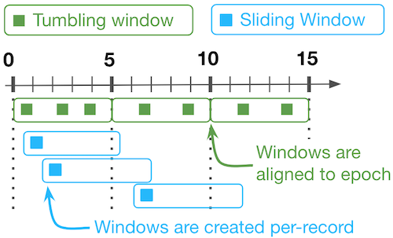

# Windowing
---

Fluxtion supports windowing operations in a DataFlow to aggregate data. There are four types of windows supported:

- Tumbling window with custom start/stop triggers
- Tumbling time based windows start/stop triggers fire on a timer
- Sliding time based windows bucket size is timer based, calculations fire on a timer
- Sliding windows bucket size is based on count calculations fire on a bucket count

Fluxtion does not run threads, it is an event driven data structure. On a calculation cycle the window monitors read 
the time of the clock and expire windows if necessary.

!!! info "advancing time"
    To advance time in an event processor send any event regularly, this causes the window expiry calculation to run


### Tumbling windows

Imagine tumbling windows as distinct buckets collecting data for a fixed size window. Once a bucket fills up, it's closed and 
published downstream. A new, empty bucket is created to collect the next batch of data. Tumbling windows never overlap, 
ensuring all data points are processed exactly once. This is good for capturing complete snapshots of the data at regular intervals.

### Sliding windows

Think of sliding window as a constantly moving window on the data stream. The window has a fixed size, but it advances 
by a set increment (called the slide). As the window slides forward, new data enters at the front, and old data falls 
out the back. Unlike tumbling windows, sliding windows can overlap significantly, with data points contributing to 
multiple windows. This is useful for capturing trends and changes happening over time. As each slide occurs downstream
nodes are triggered.

### Diagram comparing tumbling and sliding windows



### Tumbling time window

Fluxtion supports a tumbling time window for any DataFlow node with this call:

`tumblingAggregate(Supplier<AggregateFlowFunction> aggregateFunction, int bucketSizeMillis)`

The lifecycle of the AggregateFlowFunction is managed by the event processor, tracking the current time and firing 
notifications to child nodes when the timer expires. Reset calls to the stateful function are also handled by the event 
processor.

An automatically added [FixedRateTrigger]({{fluxtion_src_runtime}}/time/FixedRateTrigger.java) monitors the tumbling
window for expiry an event is received. If the window has expired, the following actions occur:

* The window aggregate is calculated and cached for inspection
* The aggregate function is reset
* Downstream nodes are triggered with the cached value

This example publishes a random Integer every 10 milliseconds, the int sum calculates the current sum for the window. 
Every 300 milliseconds the cumulative sum for the window just expired is logged to console.

```java
public class TumblingWindowSample {
    public static void main(String[] args) throws InterruptedException {
        DataFlow processor = DataFlowBuilder
                .subscribe(Integer.class)
                .tumblingAggregate(Aggregates.intSumFactory(), 300)
                .console("current tumble sum:{} timeDelta:%dt")
                .build();
        Random rand = new Random();

        try (ScheduledExecutorService executor = Executors.newSingleThreadScheduledExecutor()) {
            executor.scheduleAtFixedRate(
                    () -> processor.onEvent(rand.nextInt(100)),
                    10, 10, TimeUnit.MILLISECONDS);
            Thread.sleep(4_000);
        }
    }
}
```

Running the example code above logs to console

```console
current tumble sum:1679 timeDelta:305
current tumble sum:1398 timeDelta:604
current tumble sum:1404 timeDelta:904
current tumble sum:1518 timeDelta:1204
current tumble sum:1619 timeDelta:1504
current tumble sum:1282 timeDelta:1804
current tumble sum:1303 timeDelta:2103
current tumble sum:1285 timeDelta:2403
current tumble sum:1614 timeDelta:2704
current tumble sum:1167 timeDelta:3004
current tumble sum:1483 timeDelta:3304
current tumble sum:1631 timeDelta:3603
current tumble sum:1161 timeDelta:3905
```

###Tumbling trigger based window

To create a tumbling cart that is none-time based we use the trigger overrides to control resetting and publishing the
values in the tumbling window:

```java
resetTrigger(resetSignal)
publishTriggerOverride(publishSignal)
```

In this example we have a shopping cart that can have at the most three items. The cart can be cleared with a ClearCart
event. A GoToCheckout event publishes the contents of the cart down stream if the number of items > 0;

```java
public class TumblingTriggerSample {
    public record ClearCart() {}

    public record GoToCheckout() {}

    public static void main(String[] args) {
        var resetSignal = DataFlowBuilder
                .subscribe(ClearCart.class)
                .console("\n--- CLEAR CART ---");
        
        var publishSignal = DataFlowBuilder
                .subscribe(GoToCheckout.class)
                .console("\n--- CHECKOUT CART ---");

        DataFlow processor = DataFlowBuilder
                .subscribe(String.class)
                .aggregate(Collectors.listFactory(3))
                .resetTrigger(resetSignal)
                .publishTriggerOverride(publishSignal)
                .filter(l -> !l.isEmpty())
                .console("CURRENT CART: {}")
                .build();

        processor.onEvent("Gloves");
        processor.onEvent("Toothpaste");
        processor.onEvent("Towel");
        processor.onEvent("Plug");
        processor.onEvent("Mirror");
        processor.onEvent("Drill");
        processor.onEvent("Salt");

        processor.onEvent(new ClearCart());
        processor.onEvent("Apples");
        processor.onEvent("Camera");

        processor.onEvent(new GoToCheckout());
    }
}
```

Running the example code above logs to console

```console
--- CLEAR CART ---

--- CHECKOUT CART ---
CURRENT CART: [Apples, Camera]
```

###Sliding time window

Fluxtion supports a sliding time window for any DataFlow node with this call:

`slidingAggregate(Supplier<AggregateFlowFunction> aggregateFunction, int bucketSizeMillis, int bucketsPerWindow)`

The lifecycle of the AggregateFlowFunction is managed by the event processor, tracking the current time and firing
notifications to child nodes when the timer expires. 

An automatically added [FixedRateTrigger]({{fluxtion_src_runtime}}/time/FixedRateTrigger.java) monitors the sliding
window for expiry an event is received. If the window has expired, the following actions occur:

* The aggregate for the current window is calculated and combined with the aggregate for the whole sliding window
* The aggregate for the oldest window is deducted from the aggregate for the whole sliding window
* The aggregate for the whole sliding window is cached and stored for inspection
* Downstream nodes are triggered with the cached value

This example publishes a random Integer every 10 milliseconds, the int sum calculates the current sum for the window.
There are 4 buckets each of 300 milliseconds in size, once every 300 milliseconds the aggregate sum for the past 1.2 
seconds is logged to console.

As the effective window size is 1.2 seconds the sliding window values are approximately 4 times larger than the tumbling
window example that resets the sum every 300 milliseconds.

```java
public class SlidingWindowSample {
    public static void main(String[] args) throws InterruptedException {
        DataFlow processor = DataFlowBuilder
                .subscribe(Integer.class)
                .slidingAggregate(Aggregates.intSumFactory(), 300, 4)
                .console("current sliding 1.2 second sum:{} timeDelta:%dt")
                .build();

        Random rand = new Random();

        try (ScheduledExecutorService executor = Executors.newSingleThreadScheduledExecutor()) {
            executor.scheduleAtFixedRate(
                    () -> processor.onEvent(rand.nextInt(100)),
                    10, 10, TimeUnit.MILLISECONDS);
            Thread.sleep(4_000);
        }
    }
}
```

Running the example code above logs to console

```console
current sliding 1.2 second sum:5929 timeDelta:1207
current sliding 1.2 second sum:6021 timeDelta:1507
current sliding 1.2 second sum:6240 timeDelta:1805
current sliding 1.2 second sum:6211 timeDelta:2107
current sliding 1.2 second sum:5945 timeDelta:2407
current sliding 1.2 second sum:6260 timeDelta:2707
current sliding 1.2 second sum:6158 timeDelta:3006
current sliding 1.2 second sum:6071 timeDelta:3307
current sliding 1.2 second sum:6073 timeDelta:3605
current sliding 1.2 second sum:5903 timeDelta:3905
```