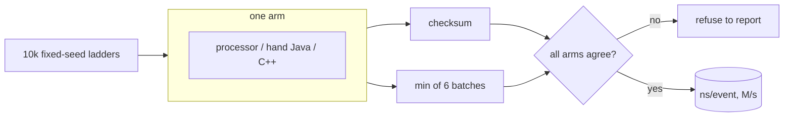

# Performance
---

Fluxtion can generate ahead-of-time, high-performance event processors suitable for demanding low‑latency environments.
This page explains the benchmark used, how to reproduce it, and why the generated code is able to reach the reported
numbers. New diagrams illustrate the event flow, dependency ordering, and the benchmark harness.

Every figure here is ns/event on a single thread, taken with the latency kit described under
*Benchmark harness*: interleaved arms, minimum of six batches, repeatability gated, and a checksum that
must agree across every arm before a number is reported at all.

!!! note "Results are in the nanosecond range"
    Fluxtion operates with sub-microsecond response times for realistic graphs. The event dispatch
    overhead of the generated processor is in the low-nanosecond range; on this benchmark it is **0.18 ns
    over hand-written Java**. Most time is spent in user logic — which on a four-node benchmark is a
    small amount, so the framework's share here is larger than it will be in your application.

## Summary results

One application graph — a market-data price ladder, four nodes, real array work — measured under every
profile, on both toolchains, against a hand-written Java control and a hand-written C++ control that are
proven to compute the identical result.

| | JIT | native AOT |
|---|---:|---:|
| **Dispatch, no audit** (`LOWEST_LATENCY`) | 9.4 ns · 106 M/s | **4.5 ns · 222 M/s** |
| **Audited, binary record** | 20.4 ns · 49 M/s | **18.2 ns · 55 M/s** |
| Hand-written Java, no framework | 6.4 ns · 156 M/s | 4.3 ns · 233 M/s |

- **The framework costs 0.18 ns/event — 4% — over hand-written flat Java under native AOT.**
- Zero allocation in steady state on every un-audited arm.
- Single thread, no core pinning, no OS isolation.

!!! warning "These figures replace an earlier version of this page, and the change is large"
    This page previously reported **50 M events/sec and ~20 ns/event**, from a JMH benchmark built
    against **Fluxtion 9.7.5 (January 2025)** under the old `com.fluxtion` group id, on an unrecorded
    machine, JIT only, at a single configuration. It was not wrong when written; it had simply stopped
    describing this framework. The current figures come from the same benchmark **ported to the current
    runtime** and re-measured from scratch.

## Test subject and setup

The benchmark processes a market data update and performs four calculations per price ladder event:

```java
public class PriceLadder {
    private final int[] bidSizes = new int[5];
    private final int[] bidPrices = new int[5];
    private final int[] askSizes = new int[5];
    private final int[] askPrices = new int[5];
}
```

| Eval order | Node | Work |
|---|---|---|
| 1 | `MidCalculator` | mid price from the touch |
| 2 | `SkewCalculator` | add a configurable skew to all ten price levels |
| 3 | `LevelsCalculator` | zero every level beyond `maxLevels` |
| 4 | `PriceLadderPublisher` | publish the result to a consumer |

- 10,000 randomly generated ladders from a **fixed seed**, cycled. Every arm sees identical input; the
  published benchmark reseeded per iteration, which is right for JMH's statistics and useless for
  comparing two arms, because they then do arithmetic on different numbers.
- Single thread, no pinning. Apple M4, OpenJDK 25.0.2, Oracle GraalVM 25.0.4+7.1.
- Native: `--gc=epsilon`, `-H:-SpawnIsolates`, PGO collected per image.
- **The nodes mutate the input ladder in place**, so state accumulates across passes. That is inherent
  to this workload and identical for every arm at equal iteration counts.

**Every arm prints a checksum and they must all agree.** The C++, hand-written-Java, and generated-
processor arms produce the same value to the digit at every iteration count. Without that, a benchmark
compares two different programs and reports the difference as a result.

## Results: the whole configuration spectrum

Some applications want an audit trail and some do not, so both are reported. All figures ns/event, one
thread, no-op audit sink, **excluding any disk or network write**.

| configuration | audit | JIT ns | JIT M/s | native ns | native M/s |
|---|:---:|---:|---:|---:|---:|
| C++ `-O3 -march=native`, hand-written | — | — | — | **1.16** | 864 |
| Hand-written Java, no framework | no | 6.39 | 156 | 4.30 | 233 |
| **`LOWEST_LATENCY`** | no | 9.41 | 106 | **4.47** | **222** |
| No configuration at all | no | 15.07 | 66 | 14.71 | 68 |
| **`LOW_LATENCY_AUDIT` + `BINARY`** | yes | 20.44 | 49 | **18.16** | **55** |
| `LOW_LATENCY_AUDIT` + `TEXT` | yes | 42.30 | 24 | 50.61 | 20 |
| `AUDITED` — every capability on, tracing | yes | **112.33** | 8.9 | 200.81 | 5.0 |

Native no-audit figures are the mean of three independent PGO builds — hand
4.299 / 4.292 / 4.301, generated 4.511 / 4.507 / 4.404. The spread is **0.009 ns** on the hand-written arm
and 0.107 on the generated one: the build lottery that dominates an audited path is essentially absent
when the path is lean.

### What the table says

- **Native AOT is the right choice for a lean path, by a wide margin** — 4.5 ns against 9.4, and with a
  far tighter spread. It is also *closer to hand-written Java* than the JIT manages: 5% against 49%.
- **Native AOT is the wrong choice for a text-heavy audit path.** At `AUDITED` the JIT wins by 1.8×
  (112.3 against 200.8), and on a text record by 1.2×. Closed-world compilation cannot speculate its way
  through string formatting the way HotSpot does. **Choose the toolchain for the profile, not the other
  way round.**
- **Configuring nothing costs 3.3× the tuned configuration** — 14.7 ns against 4.5 on native. Per event
  that is a clock read, three dirty-flag stores, three guard checks and three resets, plus a node-name
  auditor and subscription manager in the generated class. None of it is wrong; all of it is optional.
  See [performance profiles](performance-profiles.md).
- **Keeping an audit trail costs 13.7 ns on native**, binary record — for a graph whose nodes log nothing
  explicitly. That is the machinery: timestamps, record lifecycle, node registration. A graph whose nodes
  log values pays more, in proportion to how much they log.

## How close is this to C++?

Close on the framework, not on the platform, and the distinction matters.

| | native ns | vs hand-written Java |
|---|---:|---:|
| C++, `-O3 -march=native` | 1.16 | — |
| Hand-written Java | 4.30 | — |
| **Fluxtion generated processor** | **4.47** | **+0.18 ns (+4.1%)** |

**What Fluxtion costs is 0.18 ns.** That is the number this page can defend: the generated processor
against a human writing the same four calculations as straight-line Java, same data, same result, three
independent builds each with a spread under 0.02 ns.

**The remaining 3.1 ns is Java, not Fluxtion.** It is present in full in the hand-written Java arm, which
uses no framework at all. Two candidate explanations were tested and **both were refuted**:

- *Auto-vectorisation of the five-element loops.* Rebuilding the C++ with `-fno-vectorize
  -fno-slp-vectorize` made it **faster** (1.06 ns), not slower.
- *Data layout* — a C++ ladder is one flat 80-byte struct, a Java ladder is five heap objects. A Java
  variant using one flat `int[]` for all 10,000 ladders was **slower** (5.91 ns), not faster: the
  object form's fixed-length-5 arrays let the compiler remove bounds checks that a computed base index
  defeats.

- *Array bounds checking* — twenty-odd checks per event that C++ does not perform. Adding **explicit
  bounds and null checks to the C++**, one per access, cost **nothing at all**: 1.160 ns against 1.159.
  The compiler proves the indices in range and deletes them, which is exactly what a JIT tries and
  largely fails to do here.

Three hypotheses, three refutations. What is claimed is narrower and better supported: *on this workload
the Java-to-C++ gap belongs to the platform, and Fluxtion adds 4% on top of what a good Java programmer
writes by hand.*

### Would generating C++ close it?

On the evidence, yes — because **the generated shape costs nothing in C++**.

The Fluxtion-generated processor's structure — one object per node holding pointers to its parents, a
dirty flag written per node, a guard check before each trigger, a service prologue and epilogue — was
transliterated into C++ and measured against the flat hand-written version:

| | native ns |
|---|---:|
| C++ hand-written, flat | 1.159 |
| **C++ in the generated processor's shape** | **1.157** |

Identical. Every node object, dirty flag and guard check inlines away completely. **The code shape a
generator emits is not what costs anything** — in either language. It costs 4% in Java and 0% in C++,
which says the overhead is the runtime's, not the generation strategy's.

### How would C++ handle an audit log?

Very well, and the gap is much wider than on dispatch.

| | native ns | audit cost |
|---|---:|---:|
| C++, no audit | 1.159 | — |
| C++ + binary audit machinery | 4.074 | **2.92** |
| C++ + audit, 4 values logged/event | 4.327 | 3.17 (**0.06 ns per logged value**) |
| Java `LOWEST_LATENCY` | 4.474 | — |
| Java `LOW_LATENCY_AUDIT` + `BINARY` | 18.161 | **13.69** |

Same record layout — two aligned 64-bit slots per entry, ids not names, one clock read per event, the
same publish decision. **C++ carries the audit machinery for 2.9 ns where Java pays 13.7**, and a logged
value costs it **0.06 ns** against several nanoseconds in Java.

Part of that is the clock: `mach_absolute_time()` costs 4.8 ns against `System.nanoTime()`'s 8.0, and
inside real work the marginal cost of both is lower. The rest is the same platform difference visible on
the dispatch path, applied to a hotter loop.

!!! note "An earlier version of this page claimed parity with C++"
    It reported 1.57 ns for a generated processor against 1.57 ns for hand-optimised C++. That
    measurement was real, but it was taken on a **dispatch-only graph** whose nodes do almost no work —
    where the event path is nearly all framework and there is little for a C++ compiler to be better at.
    On a graph doing real array work the gap opens up, and it opens up for hand-written Java too.

## Performance as business value

In event-driven systems, performance is not just a technical metric — it is a primary driver of operational efficiency and cost reduction:

- **Lower Infrastructure Spend**: 222M events per second on a single core, or 55M with an audit trail, allows for substantial consolidation of infrastructure.
- **Fewer Instances**: High throughput per core means your application requires fewer servers, reducing both cloud costs and maintenance overhead.
- **Stable Tail Latency**: Predictable p99/p99.9 latency reduces the need for "over-provisioning" resources to handle occasional spikes caused by GC or coordination overhead.
- **Operational Confidence**: A system that responds in nanoseconds with zero GC has a much larger "headroom" before reaching saturation, providing a buffer against unexpected market volatility.

---

## Benchmark harness at a glance


```mermaid
flowchart LR
    GEN[10k fixed-seed ladders] --> ARM
    subgraph ARM[one arm]
      EP[processor / hand Java / C++]
    end
    ARM --> CHK[checksum]
    ARM --> T[min of 6 batches]
    CHK --> GATE{all arms agree?}
    T --> GATE
    GATE -->|no| REF[refuse to report]
    GATE -->|yes| OUT[(ns/event, M/s)]
```

Every arm proves what it measured before it is allowed to report: the profile asked for is the profile
generated (un-audited arms must publish **no** records, audited arms must publish them), and every arm
must produce the same checksum. Each of those assertions exists because its absence once produced a
plausible wrong number — including a `LOW_LATENCY_AUDIT` profile that had silently disabled the audit
log and therefore benchmarked very well indeed.

Repeatability is gated rather than assumed: three batches of six, refused if the coefficient of variation
of the batch minima exceeds 2% native or 8% JIT. Measured repeatability on this machine is **0.05%
native and around 5% JIT**, so a JIT difference under a few percent is not a difference and is not
reported as one.

## Reproducibility and guidance

Native results additionally need **three independent builds per arm**. Rebuilding one configuration moves
an *audited* figure by up to ±8 ns, because the PGO profile decides which regime a build lands in and
profile collection is itself a measurement. Minimise *within* a build to remove measurement noise;
average *across* builds, because minimising across builds samples the lucky tail of the lottery and
reports a figure no deployment will see. On the lean un-audited path the lottery is absent — the spread
across three builds here was under 0.02 ns.

Tips for consistent results:

- Match the toolchain versions recorded above; a figure from another environment is not comparable
- Run on an idle machine — the harness refuses above a load average of 4
- Construct the processor **inside** the measured method; letting it escape costs 4.3× under native AOT
- Disable turbo boost / fix the CPU frequency if you can, and avoid background load
- Ensure warmup is sufficient for steady state

## Notes on GC and memory

The hot path allocates nothing; objects are reused and state is contained within nodes. As a result, GC is quiescent in
steady state. If you integrate additional components (logging, collections, boxing), validate that they are allocation‑
free or are moved outside the hot path.

## Caveats

- Absolute numbers depend on hardware, OS, JVM flags, and background load
- The graph is deliberately small — four nodes — so the framework is a large fraction of the measurement.
  That is the point when measuring a framework, and the opposite of what you want when sizing an
  application: a bigger graph doing more work per node will show a **smaller** relative framework cost,
  not a larger one
- The audited figures exclude the disk or network write. A sink that writes is a different measurement
- Audit figures are for a graph whose nodes log **nothing explicitly** — it is the cost of the machinery.
  A graph where every node logs values costs more; see the audit log guide

---

## See also

* **[Performance profiles](performance-profiles.md)**: what each profile turns on and off, what it costs,
  and how to choose between them.
* **[Binary audit logging](../how-to/binary-audit-logging.md)**: the low-latency audit record.
* **[The audit latency harness](audit-latency-harness.md)**: how these numbers are produced, what the
  harness refuses to report, and why a profiler sizes nothing.
* **[Comparison with RxJava and Kafka Streams](alternative-comparisons.md)**: Understand the architectural differences and why Fluxtion's compiled approach delivers superior performance.