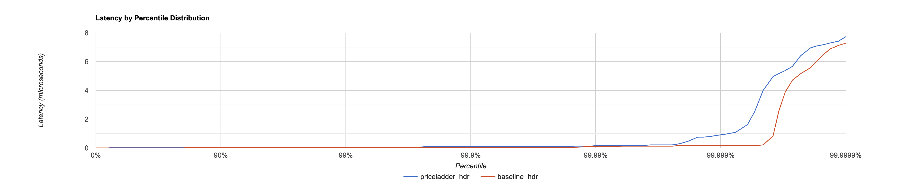

# Performance
---

Fluxtion can generate ahead-of-time, high-performance event processors suitable for demanding low‑latency environments.
This page explains the benchmark used, how to reproduce it, and why the generated code is able to reach the reported
numbers. New diagrams illustrate the event flow, dependency ordering, and the benchmark harness.

JMH is used to measure throughput and average time per event, and HdrHistogram records latency percentiles across a run.

!!! note "Results are in the nanosecond range"
    Fluxtion operates with sub‑microsecond response times for realistic graphs. The event dispatch overhead of the
    generated processor is in the low‑nanosecond range; most time is spent in user logic.

## Summary results

- 50 million events processed per second
- Average latency: ~20 ns to process one event (including application logic)
- Event processor dispatch overhead: low‑nanosecond range
- Zero GC during steady state
- Single‑threaded benchmark

## Test subject and setup

The [test project]({{fluxtion_example_src}}/compiler/aot-compiler) processes a market data update and performs a small
set of calculations for each price ladder event:

```java
public class PriceLadder {
    private final int[] bidSizes = new int[5];
    private final int[] bidPrices = new int[5];
    private final int[] askSizes = new int[5];
    private final int[] askPrices = new int[5];
}
```

- A graph with four nodes, each performing calculations
- 10,000 randomly generated events per iteration to avoid data bias
- Single thread, no core pinning or OS isolation
- AOT‑generated event processor under test (no reflection, no graph traversal at runtime)

The goal is a representative test with randomly distributed inputs to mitigate branch prediction artifacts and hot
value reuse.

### Nodes and evaluation order

| Eval order | Class                                                                                                                                                        | Description                                                                                         |
|------------|--------------------------------------------------------------------------------------------------------------------------------------------------------------|-----------------------------------------------------------------------------------------------------|
| Node 1     | [MidCalculator]({{fluxtion_example_src}}/compiler/aot-compiler/src/main/java/com/telamin/fluxtion/example/compile/aot/node/MidCalculator.java)               | Mid price calculator                                                                                |
| Node 2     | [SkewCalculator]({{fluxtion_example_src}}/compiler/aot-compiler/src/main/java/com/telamin/fluxtion/example/compile/aot/node/SkewCalculator.java)             | Adjust each level by a configurable skew                                                            |
| Node 3     | [LevelsCalculator]({{fluxtion_example_src}}/compiler/aot-compiler/src/main/java/com/telamin/fluxtion/example/compile/aot/node/LevelsCalculator.java)         | Remove levels (set price/volume to 0) if max levels < input ladder level count                      |
| Node 4     | [PriceLadderPublisher]({{fluxtion_example_src}}/compiler/aot-compiler/src/main/java/com/telamin/fluxtion/example/compile/aot/node/PriceLadderPublisher.java) | Publish the calculated PriceLadder to a consumer                                                    |

#### Dependency flow (logical)


### Calculation code for nodes

To simulate realistic application logic, each node performs a small set of calculations.

#### MidCalculator

```java
import com.telamin.fluxtion.example.compile.aot.pricer.PriceLadder;
import com.telamin.fluxtion.example.compile.aot.pricer.PriceLadderConsumer;
import com.telamin.fluxtion.runtime.annotations.ExportService;

public class MidCalculator implements @ExportService PriceLadderConsumer {

    private int mid;
    private PriceLadder priceLadder;

    @Override
    public boolean newPriceLadder(PriceLadder priceLadder) {
        mid = (priceLadder.getAskPrices()[0] + priceLadder.getBidPrices()[0]) / 2;
        this.priceLadder = priceLadder;
        //If the JMH results seems quick un-comment the lines below to see the effect on the results
//        try {
//            Thread.sleep(1);
//        } catch (InterruptedException e) {
//            throw new RuntimeException(e);
//        }
        return true;
    }

    public int getMid() {
        return mid;
    }

    public PriceLadder getPriceLadder() {
        return priceLadder;
    }
}
```

#### SkewCalculator

```java
import com.telamin.fluxtion.example.compile.aot.pricer.PriceCalculator;
import com.telamin.fluxtion.example.compile.aot.pricer.PriceLadder;
import com.telamin.fluxtion.runtime.annotations.ExportService;
import com.telamin.fluxtion.runtime.annotations.OnTrigger;

public class SkewCalculator implements @ExportService(propagate = false)PriceCalculator {

    private final MidCalculator midCalculator;
    private PriceLadder skewedPriceLadder;
    private int skew;

    public SkewCalculator(MidCalculator midCalculator) {
        this.midCalculator = midCalculator;
    }

    public SkewCalculator() {
        this(new MidCalculator());
    }

    @Override
    public void setSkew(int skew) {
        this.skew = skew;
    }

    @OnTrigger
    public boolean calculateSkewedLadder(){
        PriceLadder priceLadder = midCalculator.getPriceLadder();

        int[] bidPrices = priceLadder.getBidPrices();
        for (int i = 0, bidPricesLength = bidPrices.length; i < bidPricesLength; i++) {
            int bidPrice = bidPrices[i];
            bidPrices[i] = bidPrice + skew;
        }

        int[] askPrices = priceLadder.getAskPrices();
        for (int i = 0, askPricesLength = askPrices.length; i < askPricesLength; i++) {
            int askPrice = askPrices[i];
            askPrices[i] = askPrice + skew;
        }

        return true;
    }

    public PriceLadder getSkewedPriceLadder() {
        return midCalculator.getPriceLadder();
    }
}
```

#### LevelsCalculator

```java
import com.telamin.fluxtion.example.compile.aot.pricer.PriceCalculator;
import com.telamin.fluxtion.example.compile.aot.pricer.PriceLadder;
import com.telamin.fluxtion.runtime.annotations.ExportService;
import com.telamin.fluxtion.runtime.annotations.OnTrigger;

public class LevelsCalculator implements @ExportService(propagate = false)PriceCalculator {
    
    private final SkewCalculator SkewCalculator;
    private PriceLadder skewedPriceLadder;
    private int maxLevels;

    public LevelsCalculator(SkewCalculator SkewCalculator) {
        this.SkewCalculator = SkewCalculator;
    }

    public LevelsCalculator() {
        this(new SkewCalculator());
    }

    @Override
    public void setLevels(int maxLevels) {
        this.maxLevels = maxLevels;
    }

    @OnTrigger
    public boolean calculateLevelsForLadder(){
        PriceLadder priceLadder = SkewCalculator.getSkewedPriceLadder();

        int[] bidPrices = priceLadder.getBidPrices();
        int[] bidSizes = priceLadder.getBidSizes();
        for (int i = maxLevels, bidPricesLength = bidPrices.length; i < bidPricesLength; i++) {
            bidPrices[i] = 0;
            bidSizes[i] = 0;
        }

        int[] askPrices = priceLadder.getAskPrices();
        int[] askSizes = priceLadder.getAskSizes();
        for (int i = maxLevels, askPricesLength = askPrices.length; i < askPricesLength; i++) {
            askPrices[i] = 0;
            askSizes[i] = 0;
        }

        return true;
    }

    public PriceLadder getLevelAdjustedPriceLadder() {
        return SkewCalculator.getSkewedPriceLadder();
    }
}
```

#### PriceLadderPublisher

```java
import com.telamin.fluxtion.example.compile.aot.pricer.PriceCalculator;
import com.telamin.fluxtion.example.compile.aot.pricer.PriceLadder;
import com.telamin.fluxtion.runtime.annotations.ExportService;
import com.telamin.fluxtion.runtime.annotations.OnTrigger;

public class PriceLadderPublisher implements @ExportService(propagate = false)PriceCalculator {
    
    private final LevelsCalculator LevelsCalculator;
    private PriceLadder skewedPriceLadder;
    private PriceDistributor priceDistributor;

    public PriceLadderPublisher(LevelsCalculator LevelsCalculator) {
        this.LevelsCalculator = LevelsCalculator;
    }

    public PriceLadderPublisher() {
        this(new LevelsCalculator());
    }

    @Override
    public void setPriceDistributor(PriceDistributor priceDistributor) {
        this.priceDistributor = priceDistributor;
    }

    @OnTrigger
    public boolean publishPriceLadder(){
        priceDistributor.setPriceLadder(LevelsCalculator.getLevelAdjustedPriceLadder());
        return true;
    }
}
```

### Why AOT helps: generated event processor

Fluxtion generates an ahead‑of‑time (AOT) event processor specialized to the declared graph and dependencies. The
resulting class:

- Routes events without reflection or dynamic lookup
- Holds direct references to nodes and runs them in dependency order
- Avoids general graph traversal and allocation on the hot path
- Uses straight‑line, branch‑predictable logic
- Monomorphic dispatch within the event processor allows the jvm to optimises method calls

Generated code for this test: [PriceLadderProcessor.java]({{fluxtion_example_src}}/compiler/aot-compiler/src/main/java/com/telamin/fluxtion/example/compile/aot/generated/PriceLadderProcessor.java)

A conceptual view of event dispatch in the generated processor:


#### AOT generated dispatch method for PriceLadder

The Fluxtion compiler calculates the dependency order for each method and generates a bespoke dispatch method for each
event type. In this case, the event processor dispatches to the exported interface method `PriceLadderConsumer#newPriceLadder(PriceLadder)`, 
to process PriceLadder events. 

As the MidCalculator exports the service interface `PriceLadderConsumer`, the event processor also implements the
PriceLadderConsumer interface and proxies calls to the MidCalculator. Client code calls the interface method directly on the processor.

#### Sample dispatch java code

```java
public class PriceLadderProcessor
        implements CloneableDataFlow<PriceLadderProcessor>,
        /*--- @ExportService start ---*/
        @ExportService PriceCalculator,
        @ExportService PriceLadderConsumer,
        @ExportService ServiceListener,
        /*--- @ExportService end ---*/
        DataFlow,
        InternalEventProcessor,
        BatchHandler {
            
    // Code removed for brevity       
            
    //EXPORTED SERVICE FUNCTIONS - START
    @Override
    public boolean newPriceLadder(com.telamin.fluxtion.example.compile.aot.pricer.PriceLadder arg0) {
        beforeServiceCall(
                "public boolean com.telamin.fluxtion.example.compile.aot.node.MidCalculator.newPriceLadder(com.telamin.fluxtion.example.compile.aot.pricer.PriceLadder)");
        ExportFunctionAuditEvent typedEvent = functionAudit;
        isDirty_midCalculator_3 = midCalculator_3.newPriceLadder(arg0);
        if (guardCheck_skewCalculator_2()) {
            isDirty_skewCalculator_2 = skewCalculator_2.calculateSkewedLadder();
        }
        if (guardCheck_levelsCalculator_1()) {
            isDirty_levelsCalculator_1 = levelsCalculator_1.calculateLevelsForLadder();
        }
        if (guardCheck_priceLadderPublisher_0()) {
            priceLadderPublisher_0.publishPriceLadder();
        }
        afterServiceCall();
        return true;
    }
}
```

## Throughput and average time

```console
Benchmark                                            Mode  Cnt         Score   Error  Units
PriceLadderBenchmark.throughPut_BranchingProcessor  thrpt    2  50872626.050          ops/s
PriceLadderBenchmark.avgTime_BranchingProcessor      avgt    2        20.234          ns/op
```

The average time to process one event is ~20 ns, including all application logic executed by each node.

## Latency distribution

At 99.99% the latency is ~0.083 µs, which necessarily includes machine jitter. HdrHistogram adds a few nanoseconds per
recorded sample. The tail aligns with a “no‑work” jitter baseline on the same machine, indicating the tail is dominated
by platform jitter rather than application logic.

[](../images/aot_latency_histogram.png){:target="_blank"}

- Blue: total latency with application work
- Red: baseline machine jitter (“no processing”)

## Benchmark harness at a glance


## Reproducibility and guidance

You can reproduce results from the example project referenced above. Typical steps:

1. Clone the examples repository and build it.
2. Run the aot‑compiler benchmark target with your local JDK.

Example (from the examples project root, adjust for your environment):

```bash
./mvnw -q -pl compiler/aot-compiler -am -DskipTests package
java -jar compiler/aot-compiler/target/benchmarks.jar PriceLadderBenchmark -wi 5 -i 5 -f 1
```

Tips for consistent results:

- Use Java 21 (matching Fluxtion’s toolchain)
- Disable turbo boost / set a fixed CPU frequency if possible
- Run on an isolated core; avoid background load
- Prefer Linux with performance governor for stable jitter characteristics
- Ensure warmup is sufficient for steady state

## Notes on GC and memory

The hot path allocates nothing; objects are reused and state is contained within nodes. As a result, GC is quiescent in
steady state. If you integrate additional components (logging, collections, boxing), validate that they are allocation‑
free or are moved outside the hot path.

## Caveats

- Absolute numbers depend on hardware, OS, JVM flags, and background load
- HdrHistogram introduces minimal measurement overhead which is included in reported numbers
- The example graph is deliberately small; more complex graphs will scale very well but absolute ns/op will reflect the
  extra application work