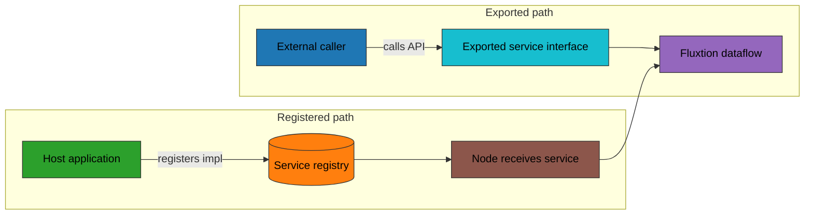

# Services in Fluxtion: introduction

Fluxtion services provide a lightweight way to integrate your dataflow with the outside world without breaking the
event-driven model. They let you:

- Export capabilities from inside the graph to be called by external code (Exported Service).
- Import capabilities provided by the host application into the graph so nodes can use them (Registered Service).

## Conceptual model
Think of services as dependency boundaries:

- Exported services: your graph exposes a typed interface that external code can invoke in-process and type-safely.
- Registered services: your graph consumes a typed interface supplied by the host (e.g., caches, configuration
  providers, metrics, clients).

### Exported vs Registered (at a glance)

## Why services are useful
- Clear separation of concerns and testability: nodes depend on interfaces, not concrete infrastructure.
- Flexible deployment: swap implementations (e.g., a mock cache in tests vs. a real cache in prod) without regenerating
  the graph.
- Discoverability and safety: services are declared explicitly and discovered by annotations, avoiding global singletons
  or brittle lookups.
- Encapsulation: your graph can publish just the intended surface area (export) while keeping internals private.

## Two patterns
1. Exported service (ExportService)
   - A node implements an interface and marks it as exported. After building the processor, callers obtain a proxy to
     that interface and invoke it directly. Fluxtion ensures calls are routed into the graph safely.
2. Registered service (ServiceRegistered)
   - The host registers a service instance with the processor at runtime. Nodes that need the service declare a
     callback using the @ServiceRegistered annotation and receive the service instance and an optional name.

## When to use which?
- Use ExportService when external code needs to call into your dataflow and trigger work, but you want a stable, typed
  API rather than sending raw events.
- Use ServiceRegistered when your dataflow needs to use an external capability (cache, database client, logger, feature
  flag store, etc.) supplied by the host application.

## Guides
- [Service export guide](service-export.md)
- [Service registered guide](service-registered.md)
