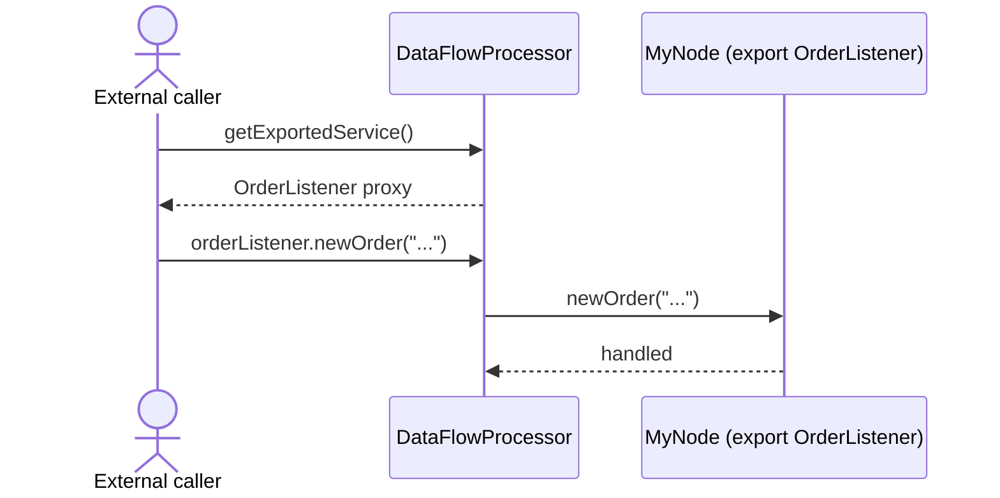

# Service export guide

Exported services let a node expose a typed interface that external callers can use to invoke logic inside the dataflow.
The node advertises the interface using @ExportService, and the built processor exposes a type-safe handle via
getExportedService().

## Example: exporting an OrderListener

Source: [ServiceExportExample.java]({{ extra.fluxtion_example_src }}/reference/src/main/java/com/telamin/fluxtion/example/reference/bindnode/service/ServiceExportExample.java)

```java
package com.telamin.fluxtion.example.reference.bindnode.service;

import com.telamin.fluxtion.builder.DataFlowBuilder;
import com.telamin.fluxtion.runtime.annotations.ExportService;
import com.telamin.fluxtion.runtime.annotations.OnEventHandler;

public class ServiceExportExample {

    public static class MyNode implements @ExportService OrderListener {

        @OnEventHandler
        public boolean handleStringEvent(String stringToProcess) {
            System.out.println("MyNode::handleStringEvent received:" + stringToProcess);
            return true;
        }

        @Override
        public void newOrder(String order) {
            System.out.println("MyNode::newOrder received:'" + order + "'");
        }

        @Override
        public void orderComplete(String order) {
            System.out.println("MyNode::orderComplete received:'" + order + "'");
        }
    }

    public static void main(String[] args) {
        var processor = DataFlowBuilder
                .subscribeToNode(new ServiceExportExample.MyNode())
                .build();

        OrderListener orderListener = processor.getExportedService();

        orderListener.newOrder("test-order-1");
        orderListener.orderComplete("test-order-2");
    }
}
```

## How it works
- The node MyNode implements OrderListener and annotates that interface with @ExportService.
- After building, processor.getExportedService() returns a proxy bound to the node’s exported interface.
- External code calls methods on the interface; Fluxtion routes those calls into the graph, preserving event handling
  semantics.

## Sequence diagram


## When to use service export
- Provide a clean API for external components to drive behavior inside the graph without sending raw events.
- Encapsulate the graph’s implementation and expose only the intended operations.

## Tips
- Keep exported interfaces cohesive; prefer small, purpose-specific contracts.
- You can still listen to regular events (@OnEventHandler) inside the same node; export does not preclude event-driven
  processing.
- Use interface types for stability; avoid exposing concrete classes.
