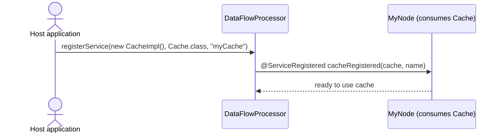

# Service registered guide

Registered services allow the host application to supply implementations to the running dataflow. Nodes declare an
interest via a method annotated with @ServiceRegistered and receive the service instance (and name) when it is
registered.

## Example: registering a Cache service

Source: [ServiceRegisteredExample.java]({{ extra.fluxtion_example_src }}/reference/src/main/java/com/telamin/fluxtion/example/reference/bindnode/service/ServiceRegisteredExample.java)

Related interfaces: Cache, CacheImpl
- [Cache.java]({{ extra.fluxtion_example_src }}/reference/src/main/java/com/telamin/fluxtion/example/reference/bindnode/service/Cache.java)
- [CacheImpl.java]({{ extra.fluxtion_example_src }}/reference/src/main/java/com/telamin/fluxtion/example/reference/bindnode/service/CacheImpl.java)

```java
package com.telamin.fluxtion.example.reference.bindnode.service;

import com.telamin.fluxtion.builder.DataFlowBuilder;
import com.telamin.fluxtion.runtime.annotations.OnEventHandler;
import com.telamin.fluxtion.runtime.annotations.runtime.ServiceRegistered;

public class ServiceRegisteredExample {

    public static class MyNode {

        @ServiceRegistered
        public void cacheRegistered(Cache cache, String cacheName) {
            System.out.println("Cache registered: " + cacheName);
        }

        @OnEventHandler
        public boolean handleStringEvent(String stringToProcess) {
            System.out.println("MyNode::handleStringEvent received:" + stringToProcess);
            return true;
        }
    }

    public static void main(String[] args) {
        var processor = DataFlowBuilder
                .subscribeToNode(new MyNode())
                .build();

        processor.registerService(new CacheImpl(), Cache.class, "myCache");
    }
}
```

## How it works
- A node declares a method annotated with @ServiceRegistered. Its parameters define the service type and receive the
  optional service name.
- The host registers a service instance with the processor via processor.registerService(service, InterfaceType, name).
- When the service is registered, Fluxtion invokes the annotated method, handing the instance to the node.

## Sequence diagram


## When to use service registration
- Your dataflow needs access to host-provided infrastructure: caches, clients, feature flags, configuration, or other
  utilities.
- You want to switch implementations without changing or regenerating the graph.

## Tips
- Depend on small, well-defined interfaces (e.g., Cache) to keep nodes decoupled from concrete infrastructure.
- Use the name parameter to differentiate multiple instances of the same service type (e.g., "hot" vs. "cold" cache).
- Combine with lifecycle callbacks if you need to react to service availability or teardown.

## Export vs. Registered quick comparison
- Exported: graph exposes an interface to the outside; external code calls into the graph.
- Registered: host supplies an interface implementation to the graph; nodes call the service.
- Together they form a clean boundary for integrating with external systems while keeping your dataflow modular and
  testable.
