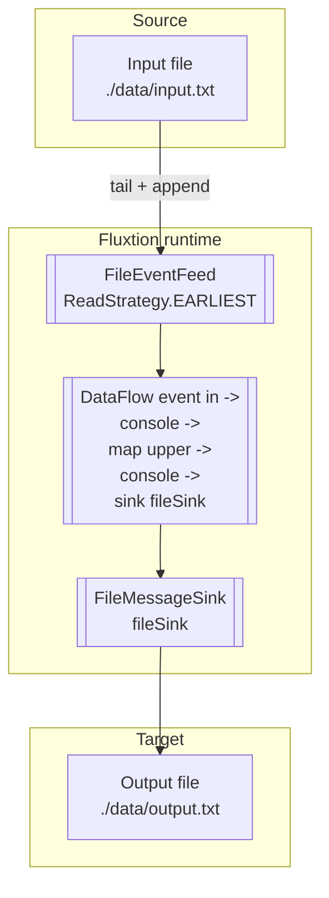
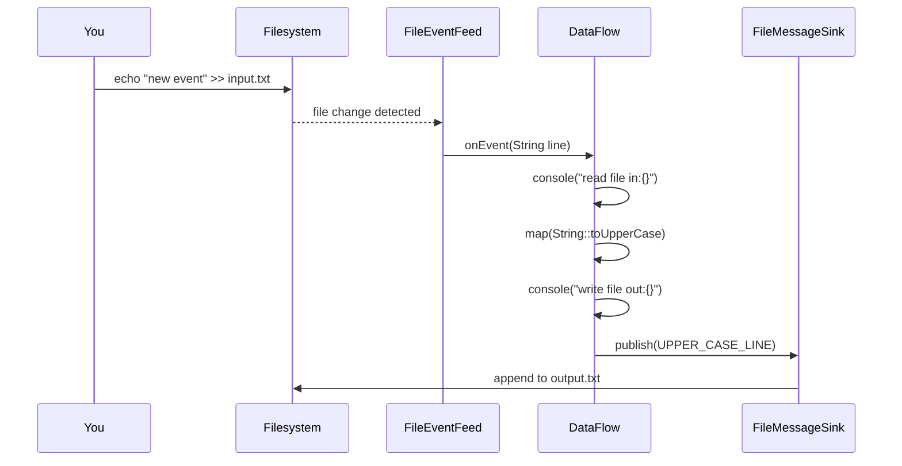

# Guide: Build, deploy, and run a sample app that embeds a DataFlow

This guide explains how to build, deploy, and run a simple Fluxtion application that embeds a DataFlow. The application
reads lines from a file, processes them through a DataFlow pipeline, and writes the transformed output to another file.

We will use the ready-made sample from this repository as the reference implementation:

- [Repository]({{fluxtion_example_src}})
- [Sample module]({{fluxtion_example_src}}/sample-apps/file-feed-sink-demo)

The sample wires together these Fluxtion components:

- FileEventFeed: streams lines from an input file as events
- DataFlow: subscribes to the feed, logs and transforms each event (upper-case)
- FileMessageSink: writes the transformed result to an output file

For background, the “getting-started” tutorial [TutorialPart5](../getting-started/tutorial-part-5.md) demonstrates a similar pipeline.

## Architecture overview


## Event flow (runtime sequence)


## 1. Prerequisites

- Java 21+
- Maven 3.8+ (build time only)

## 2. Project layout (sample)

Within this repository, navigate to the sample module:

- `FileFeedSinkDemo.java` – main app
- `data/input.txt` – example input data
- `data/output.txt` – output file (created when the app runs)
- `start.sh` – helper script to build and run the app
- `stop.sh` – stops the background run started by `start.sh --bg`

## 3. Build: create a deployable fat-jar

The sample is configured to build a shaded (fat) jar that includes all runtime dependencies and the correct `Main-Class`.

From the sample module directory:

```bash
cd sample-apps/file-feed-sink-demo
mvn -DskipTests package
```

This produces:

```
target/file-feed-sink-demo-1.0-SNAPSHOT-jar-with-dependencies.jar
```

Why a fat-jar? It’s a single, self-contained artifact that you can copy to another machine and run with `java -jar` — no
Maven needed on the target.

## 4. Run locally

You can run the app in several ways.

A. Using the helper script (foreground):

```bash
./start.sh
```

Reads `./data/input.txt` and writes `./data/output.txt`.

B. Using the helper script (background) with overrides:

```bash
./start.sh --bg --input ./data/input.txt --output ./data/output.txt
# Later stop it:
./stop.sh
```

C. Running the fat-jar directly:

```bash
java --add-opens=java.base/jdk.internal.misc=ALL-UNNAMED \
     -jar target/file-feed-sink-demo-1.0-SNAPSHOT-jar-with-dependencies.jar \
     ./data/input.txt ./data/output.txt
```

Note: the `--add-opens` option is required because the runtime uses `jdk.internal.misc.Unsafe` via Agrona.

## 5. Observe the pipeline

To see the DataFlow acting on new input lines in real time, you can tail the output and append to the input.

- Terminal 1: start the app (foreground or background)

```bash
./start.sh --bg
```

- Terminal 2: tail the output file

```bash
tail -f ./data/output.txt
```

- Terminal 3: append new lines to the input file

```bash
echo "new event one" >> ./data/input.txt
echo "another line"   >> ./data/input.txt
```

As you append, the FileEventFeed sees new lines, the DataFlow runs (upper-casing them), and the FileMessageSink pushes
the results into `data/output.txt`. You will see the transformed lines appear in real time in the `tail` output.

## 6. Sample data and expected output

A quick way to validate the end-to-end flow:

- Ensure the input file exists, then append a few lines:

```bash
echo "hello world"   >> ./data/input.txt
echo "Fluxtion rocks" >> ./data/input.txt
```

- Watch the output file (in another terminal):

```bash
tail -n +1 -f ./data/output.txt
```

Expected lines (upper-cased):

```
HELLO WORLD
FLUXTION ROCKS
```

## 7. Deploy to another machine

Because the app is packaged as a fat-jar, deployment is straightforward:

1) Build on your development machine:

```bash
cd sample-apps/file-feed-sink-demo
mvn -DskipTests package
```

2) Copy the fat-jar and any desired data files to the target machine:

```bash
scp target/file-feed-sink-demo-1.0-SNAPSHOT-jar-with-dependencies.jar user@server:/opt/fluxtion-demo/
scp -r data user@server:/opt/fluxtion-demo/
```

3) On the target machine, run with Java 21+:

```bash
cd /opt/fluxtion-demo
java --add-opens=java.base/jdk.internal.misc=ALL-UNNAMED \
     -jar file-feed-sink-demo-1.0-SNAPSHOT-jar-with-dependencies.jar \
     ./data/input.txt ./data/output.txt
```

## 8. Troubleshooting

- Missing `--add-opens` flag: If you see an error about `jdk.internal.misc.Unsafe`, add
  `--add-opens=java.base/jdk.internal.misc=ALL-UNNAMED` to your `java -jar` command line.
- File paths: Prefer absolute or carefully chosen relative paths for input/output when deploying to different
  directories.
- Permissions: Ensure the process can read the input file and write to the output directory.
- Encoding: The example assumes UTF-8. If your environment defaults to a different encoding, you may see garbled
  characters. Set `-Dfile.encoding=UTF-8` or normalize your input files.
- Line endings (CRLF vs LF): When moving files between Windows and Unix-like systems, ensure the input file uses
  consistent line endings. Mixed endings can confuse tailing and file-watch behavior.

## 9. ReadStrategy alternatives

The `FileEventFeed` supports different starting behaviors via `ReadStrategy`:

- `EARLIEST` (used in this guide): start reading from the beginning of the file and then follow new appends.
- `LATEST`: start from the current end of the file and only process new lines appended after the app starts, typically used to emulate `tail -f` behavior for logs.

Pick `LATEST` when you only care about new data; use `EARLIEST` to replay existing history.

## 10. Where to look in the source

- Sample app module [Sample module]({{fluxtion_example_src}}/sample-apps/file-feed-sink-demo)
- Main application code: [FileFeedSinkDemo.java]({{fluxtion_example_src}}/sample-apps/file-feed-sink-demo/src/main/java/com/telamin/fluxtion/example/sampleapps/FileFeedSinkDemo.java)
- Build configuration (fat-jar):  [pom.xml]({{fluxtion_example_src}}/sample-apps/file-feed-sink-demo/pom.xml)  (via `maven-shade-plugin`)

---

## Code snippets

### Main application (`FileFeedSinkDemo.java`)
```java
package com.telamin.fluxtion.example.sampleapps;

import com.telamin.fluxtion.builder.DataFlowBuilder;
import com.telamin.fluxtion.runtime.DataFlow;
import com.telamin.fluxtion.runtime.connector.DataFlowConnector;
import com.telamin.fluxtion.runtime.connector.FileEventFeed;
import com.telamin.fluxtion.runtime.connector.FileMessageSink;
import com.telamin.fluxtion.runtime.eventfeed.ReadStrategy;

public class FileFeedSinkDemo {
    public static void main(String[] args) throws Exception {
        String inputPath = args.length > 0 ? args[0] : "./data/input.txt";
        String outputPath = args.length > 1 ? args[1] : "./data/output.txt";

        // Create file feed that replays from the start of the file
        FileEventFeed inputFileFeed = new FileEventFeed(
                inputPath,
                "fileFeed",
                ReadStrategy.EARLIEST
        );

        // Build a simple dataflow
        DataFlow dataFlow = DataFlowBuilder.subscribeToFeed("fileFeed", String.class)
                .console("read file in:{}")
                .map(String::toUpperCase)
                .console("write file out:{}<br/>")
                .sink("fileSink")
                .build();

        // File sink to write transformed messages
        FileMessageSink outputFileSink = new FileMessageSink(outputPath);

        // Wire together and start
        DataFlowConnector runner = new DataFlowConnector();
        runner.addDataFlow(dataFlow);
        runner.addFeed(inputFileFeed);
        runner.addSink("fileSink", outputFileSink);

        runner.start();
    }
}
```

### Build configuration (`pom.xml`)
```xml
<plugin>
  <groupId>org.apache.maven.plugins</groupId>
  <artifactId>maven-shade-plugin</artifactId>
  <version>3.5.0</version>
  <executions>
    <execution>
      <phase>package</phase>
      <goals>
        <goal>shade</goal>
      </goals>
      <configuration>
        <createDependencyReducedPom>false</createDependencyReducedPom>
        <shadedArtifactAttached>true</shadedArtifactAttached>
        <shadedClassifierName>jar-with-dependencies</shadedClassifierName>
        <transformers>
          <transformer implementation="org.apache.maven.plugins.shade.resource.ManifestResourceTransformer">
            <mainClass>com.telamin.fluxtion.example.sampleapps.FileFeedSinkDemo</mainClass>
          </transformer>
        </transformers>
      </configuration>
    </execution>
  </executions>
</plugin>
```

### Helper scripts

- `start.sh` (builds the module and runs the shaded jar; supports background mode):
```bash
./start.sh --bg --input ./data/input.txt --output ./data/output.txt
```

- `stop.sh` (stops the background process started by `start.sh --bg`):
```bash
./stop.sh
```
